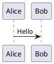

# Architecture Diagrams Project

Java project with Maven for creating and automatically generating architecture diagrams using PlantUML and C4 Model.

## 📋 Project Structure

```
arch-diagrams/
├── src/
│   ├── main/java/com/example/archdiagrams/   # Main code
│   └── test/java/com/example/archdiagrams/   # Unit tests
├── diagrams/                                 # .puml files
│   ├── *.puml                                # All diagrams 
├── docs/
│   └── generated-diagrams/                   # Automatically generated images
├── pom.xml                                    # Maven configuration
└── README.md                                  # This file
```

## 🚀 Getting Started

### Prerequisites

- Java 21 or higher
- Maven 3.6 or higher
- Graphviz (optional, for more complex diagrams)

### Installation

1. Clone or download this project
2. Run the command to install dependencies:

```bash
mvn clean install
```

## 📊 Generating Diagrams

### Automatic Generation (Recommended)

#### Using the Helper Script

```bash
# Generate PNG and SVG (faster and more intuitive)
./generate-diagrams.sh

# Other script options
./generate-diagrams.sh --png      # PNG only
./generate-diagrams.sh --svg      # SVG only
./generate-diagrams.sh --clean    # Clean and generate everything
./generate-diagrams.sh --help     # Help
```

#### Using Maven Directly

```bash
# Generate all diagrams automatically in PNG and SVG
mvn clean generate-resources
```

Diagrams will be generated in two formats:
- **PNG**: `docs/generated-diagrams/` - For viewing and documentation
- **SVG**: `docs/drawio-exports/` - For importing into draw.io

### Manual Generation

If you prefer to generate diagrams manually:

```bash
# Install PlantUML (if you don't have it)
brew install plantuml  # macOS
# or
sudo apt-get install plantuml  # Ubuntu/Debian

# Generate PNG diagrams
plantuml diagrams/*.puml -o ../docs/generated-diagrams/

# Generate SVG diagrams for draw.io
plantuml diagrams/*.puml -tsvg -o ../docs/drawio-exports/
```

### Supported Formats

The plugin is configured to generate PNG and SVG by default. For other formats, modify the `pom.xml`:

- `png` - PNG image (for documentation)
- `svg` - SVG vector image (for draw.io)
- `eps` - Encapsulated PostScript
- `pdf` - PDF document

### Using Diagrams in Draw.io

Generated SVG files can be imported directly into draw.io:

1. Go to [draw.io](https://app.diagrams.net/)
2. Click "File" → "Import from" → "Device"
3. Select the SVG file from the `docs/drawio-exports/` folder
4. The diagram will be imported and can be edited visually

**Advantages of SVG in draw.io:**
- Intuitive visual editing
- Addition of extra graphic elements
- Export to multiple formats
- Real-time collaboration

## ✏️ Editing PlantUML Diagrams

### Basic Syntax

All PlantUML diagrams start with `@startuml` and end with `@enduml`:



### Comments

Use `'` for single-line comments:

```plantuml
' This is a comment
Alice -> Bob: Message
```

### Including Libraries

To use external libraries (like C4):

```plantuml
!include https://raw.githubusercontent.com/plantuml-stdlib/C4-PlantUML/master/C4_Context.puml
```

## 🏗️ Using C4-PlantUML

### What is C4 Model?

The C4 Model is an approach to visualize software architecture in 4 levels:

1. **Context** - System overview and users
2. **Container** - High-level applications and services
3. **Component** - Components within a container
4. **Code** - Classes and interfaces (rarely used)

### Main C4-PlantUML Macros

#### Context Level

```plantuml
!include https://raw.githubusercontent.com/plantuml-stdlib/C4-PlantUML/master/C4_Context.puml

' People
Person(alias, "Name", "Description")
Person_Ext(alias, "Name", "Description")  ' External person

' Systems
System(alias, "Name", "Description")
System_Ext(alias, "Name", "Description")  ' External system

' Relationships
Rel(from, to, "Description", "Technology")
```

#### Container Level

```plantuml
!include https://raw.githubusercontent.com/plantuml-stdlib/C4-PlantUML/master/C4_Container.puml

' Containers
Container(alias, "Name", "Technology", "Description")
ContainerDb(alias, "Name", "Technology", "Description")  ' Database
Container_Ext(alias, "Name", "Technology", "Description")  ' External container

' Boundaries (groupings)
System_Boundary(alias, "System Name") {
    Container(web, "Web App", "React", "User interface")
    Container(api, "API", "Spring Boot", "Business logic")
}
```

### Practical Example

See the example files in the `diagrams/` folder:

- `c4-context-example.puml` - E-commerce context diagram
- `c4-container-example.puml` - Container diagram of the same system

### Customizations

#### Colors and Styles

```plantuml
' Define custom colors
!define TECHNOLOGY_COLOR #lightblue
!define DATABASE_COLOR #lightgreen

' Apply color to an element
Container(api, "API", "Spring Boot", "Business logic", $bgColor=TECHNOLOGY_COLOR)
```

#### Layout Direction

```plantuml
' Control layout direction
!define DIRECTION top to bottom direction
' or
!define DIRECTION left to right direction
```

## 🔧 Useful Commands

### Development

```bash
# Clean and generate diagrams (PNG + SVG)
mvn clean generate-resources

# Run tests
mvn test

# Compile project
mvn compile

# Clean generated files
mvn clean

# View dependencies
mvn dependency:tree

# Generate PNG only
mvn com.github.jeluard:plantuml-maven-plugin:generate@generate-png-diagrams

# Generate SVG only for draw.io
mvn com.github.jeluard:plantuml-maven-plugin:generate@generate-svg-diagrams

# Generate diagrams and run tests
mvn clean verify

# Run main application
mvn exec:java -Dexec.mainClass="com.example.archdiagrams.ArchitectureDiagramsApplication"
```

### Diagram Validation

```bash
# Check syntax of all diagrams
find diagrams -name "*.puml" -exec java -jar ~/.m2/repository/net/sourceforge/plantuml/plantuml/1.2024.0/plantuml-1.2024.0.jar -checkonly {} \;
```

## 🚀 CI/CD Integration

### GitHub Actions

Create `.github/workflows/diagrams.yml`:

```yaml
name: Generate Diagrams

on:
  push:
    paths:
      - 'diagrams/**'
  pull_request:
    paths:
      - 'diagrams/**'

jobs:
  generate-diagrams:
    runs-on: ubuntu-latest
    steps:
      - uses: actions/checkout@v3
      
      - name: Set up JDK 11
        uses: actions/setup-java@v3
        with:
          java-version: '11'
          distribution: 'temurin'
          
      - name: Generate diagrams
        run: mvn clean generate-resources
        
      - name: Upload diagrams
        uses: actions/upload-artifact@v3
        with:
          name: generated-diagrams
          path: docs/generated-diagrams/
```

### GitLab CI

Create `.gitlab-ci.yml`:

```yaml
stages:
  - generate-diagrams

generate-diagrams:
  stage: generate-diagrams
  image: openjdk:11-jdk
  script:
    - ./mvnw clean generate-resources
  artifacts:
    paths:
      - docs/generated-diagrams/
    expire_in: 1 week
  only:
    changes:
      - diagrams/**
```

## 📚 Additional Resources

### Official Documentation

- [PlantUML](https://plantuml.com/)
- [C4-PlantUML](https://github.com/plantuml-stdlib/C4-PlantUML)
- [C4 Model](https://c4model.com/)

### Recommended Editors

- **VS Code**: "PlantUML" extension
- **IntelliJ IDEA**: "PlantUML Integration" plugin
- **Online**: [PlantText](https://www.planttext.com/)

### Tips

1. **Keep diagrams simple**: Avoid too many elements in a single diagram
2. **Use consistent names**: Maintain standardized aliases and names
3. **Document decisions**: Use comments to explain architectural choices
4. **Version control**: Keep diagrams synchronized with code

## 🤝 Contributing

1. Add new diagrams to the `diagrams/` folder
2. Follow naming conventions: `type-name-version.puml`
3. Run `mvn clean verify` before committing
4. Document complex diagrams with comments

## 📄 License

This project is under the MIT license. See the LICENSE file for more details.