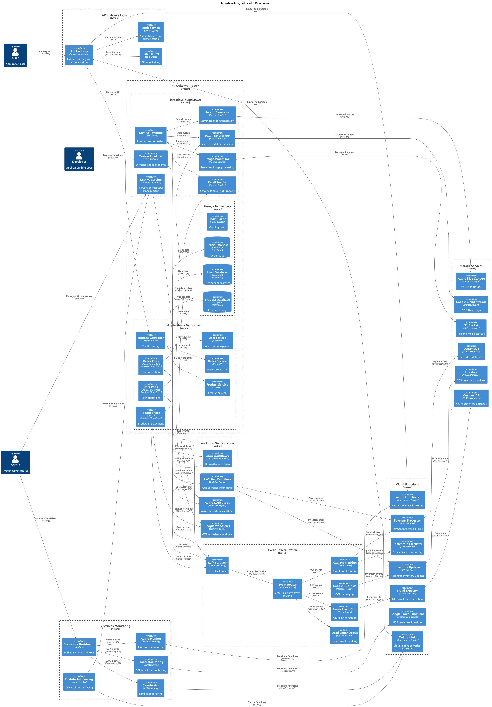

# Architecture Evolution - Containerization

This section documents the evolution journey from a traditional monolithic architecture to a complete cloud-native architecture, demonstrating each step of the transformation through containerization and orchestration.

## 1. Monolith on VM

**Description:** Traditional architecture with monolithic application running on virtual machine, including web server, application, and database in the same environment.

- **Quality Score:** 4/10
- **Implementation Difficulty:** 2/10
- **Performance Level:** Low
- **When to Use:** Simple applications, rapid prototyping, legacy systems
- **Important Points:**
  - Easy to develop and deploy initially
  - Difficult to scale components individually
  - Single point of failure
  - High coupling between components

## 2. Monolith on Docker

**Description:** First step of containerization, moving the monolith to Docker containers while maintaining the same logical structure.

- **Quality Score:** 5/10
- **Implementation Difficulty:** 3/10
- **Performance Level:** Low-Medium
- **When to Use:** First step in modernization, standardized development environments
- **Important Points:**
  - Improves portability and environment consistency
  - Facilitates CI/CD
  - Still maintains monolith limitations
  - Foundation for future evolutions

## 3. Monolith with Reverse Proxy

**Description:** Introduction of reverse proxy (Nginx) to manage traffic, SSL termination, and basic load balancing.

- **Quality Score:** 6/10
- **Implementation Difficulty:** 4/10
- **Performance Level:** Medium
- **When to Use:** Need for SSL termination, static caching, multiple instances
- **Important Points:**
  - Improves security and performance
  - Facilitates certificate management
  - Enables static content caching
  - Preparation for load balancing

## 4. Monolith on Kubernetes

**Description:** Migration of monolith to Kubernetes, leveraging orchestration, service discovery, and resource management.

- **Quality Score:** 6/10
- **Implementation Difficulty:** 6/10
- **Performance Level:** Medium
- **When to Use:** Need for orchestration, auto-scaling, high availability
- **Important Points:**
  - Gains in availability and scalability
  - Operational complexity increases
  - Solid foundation for microservices
  - Requires Kubernetes knowledge

## 5. Split into 2 Microservices

**Description:** First decomposition of the monolith into two independent microservices with separate databases.

- **Quality Score:** 7/10
- **Implementation Difficulty:** 7/10
- **Performance Level:** Medium-High
- **When to Use:** Well-defined domains, specialized teams, need for independent scalability
- **Important Points:**
  - Beginning of separation of concerns
  - Complexity of inter-service communication
  - Need for distributed transaction management
  - Foundation for future expansion

## 6. Microservices with API Gateway

**Description:** Introduction of API Gateway to centralize routing, authentication, rate limiting, and monitoring.

- **Quality Score:** 8/10
- **Implementation Difficulty:** 6/10
- **Performance Level:** High
- **When to Use:** Multiple microservices, need for centralized policies, different client types
- **Important Points:**
  - Centralizes cross-cutting concerns
  - Simplifies client-server communication
  - Controlled single entry point
  - Facilitates API versioning

## 7. Stateless Microservices

**Description:** Evolution to completely stateless microservices with distributed cache (Redis) for sessions and temporary data.

- **Quality Score:** 8/10
- **Implementation Difficulty:** 7/10
- **Performance Level:** High
- **When to Use:** High scalability, multiple instances, cloud-native applications
- **Important Points:**
  - Facilitates horizontal scalability
  - Improves system resilience
  - Requires external state management
  - Optimizes resource usage

## 8. Horizontal Scaling with HPA

**Description:** Implementation of Horizontal Pod Autoscaler (HPA) for automatic scalability based on CPU, memory, and custom metrics.

- **Quality Score:** 8/10
- **Implementation Difficulty:** 6/10
- **Performance Level:** High
- **When to Use:** Variable workloads, cost optimization, strict SLAs
- **Important Points:**
  - Automatic and efficient scalability
  - Operational cost optimization
  - Requires well-defined metrics
  - Needs careful threshold configuration

## 9. Distributed Caching

**Description:** Implementation of multi-layer distributed caching strategy for performance optimization.

- **Quality Score:** 9/10
- **Implementation Difficulty:** 7/10
- **Performance Level:** Very High
- **When to Use:** High read volume, frequently accessed data, low latency requirements
- **Important Points:**
  - Significant latency reduction
  - Decreased database load
  - Cache invalidation complexity
  - Requires consistency strategy

## 10. Event-Driven Architecture

**Description:** Evolution to event-driven architecture with message brokers (Kafka) for asynchronous communication.

- **Quality Score:** 9/10
- **Implementation Difficulty:** 8/10
- **Performance Level:** Very High
- **When to Use:** Complex distributed systems, need for decoupling, asynchronous processing
- **Important Points:**
  - High decoupling between services
  - Better resilience and fault tolerance
  - Debugging and monitoring complexity
  - Requires event sourcing expertise

## 11. Backend for Frontend (BFF)

**Description:** Implementation of BFF pattern to optimize specific APIs for different client types (web, mobile, IoT).

- **Quality Score:** 8/10
- **Implementation Difficulty:** 6/10
- **Performance Level:** High
- **When to Use:** Multiple client types, specific UI needs, payload optimization
- **Important Points:**
  - APIs optimized by client type
  - Reduction of over-fetching
  - Possible logic duplication
  - Improves user experience

## 12. Service Mesh with Istio

**Description:** Implementation of service mesh using Istio for advanced traffic management, security, and observability.

- **Quality Score:** 9/10
- **Implementation Difficulty:** 9/10
- **Performance Level:** High
- **When to Use:** Complex microservices, advanced security needs, detailed observability
- **Important Points:**
  - Granular traffic control
  - Automatic mTLS security
  - Advanced observability
  - Steep learning curve

## 13. Multi-Cluster Deployment

**Description:** Distributed architecture across multiple Kubernetes clusters for high availability and geographic distribution.

- **Quality Score:** 9/10
- **Implementation Difficulty:** 9/10
- **Performance Level:** Very High
- **When to Use:** High availability requirements, regional compliance, disaster recovery
- **Important Points:**
  - Maximum availability and resilience
  - Very high operational complexity
  - Need for cluster synchronization
  - High operational costs

## 14. GitOps with ArgoCD

**Description:** Implementation of GitOps using ArgoCD for automated deployment and declarative infrastructure management.

- **Quality Score:** 9/10
- **Implementation Difficulty:** 7/10
- **Performance Level:** High
- **When to Use:** Need for auditing, frequent deployments, multiple environments
- **Important Points:**
  - Auditable and versioned deployments
  - Automatic rollback on failures
  - Automatic synchronization with Git
  - Requires versioning discipline

## 15. Observability Stack

**Description:** Complete observability stack with Prometheus, Grafana, Jaeger, and ELK for monitoring, metrics, tracing, and logs.

- **Quality Score:** 9/10
- **Implementation Difficulty:** 8/10
- **Performance Level:** High
- **When to Use:** Complex distributed systems, need for advanced troubleshooting, strict SLAs
- **Important Points:**
  - Complete system visibility
  - Facilitates distributed systems debugging
  - Requires constant configuration and maintenance
  - Can impact performance if misconfigured

## 16. Security Hardening

**Description:** Implementation of advanced security measures including network policies, RBAC, security scanning, and secrets management.

- **Quality Score:** 9/10
- **Implementation Difficulty:** 8/10
- **Performance Level:** Medium-High
- **When to Use:** Production environments, sensitive data, strict compliance
- **Important Points:**
  - Multi-layer security
  - Compliance with security standards
  - Can add latency if misconfigured
  - Requires security expertise

## 17. Disaster Recovery

**Description:** Complete disaster recovery strategy with automated backup, cross-region replication, and failover procedures.

- **Quality Score:** 9/10
- **Implementation Difficulty:** 9/10
- **Performance Level:** High
- **When to Use:** Critical systems, low RTO/RPO requirements, regulatory compliance
- **Important Points:**
  - Guaranteed business continuity
  - Significant operational costs
  - Need for regular testing
  - Orchestration complexity

## 18. Edge Computing

**Description:** Architecture extension for edge computing with distributed processing close to end users.

- **Quality Score:** 8/10
- **Implementation Difficulty:** 9/10
- **Performance Level:** Very High
- **When to Use:** IoT applications, critical low latency, local data processing
- **Important Points:**
  - Ultra-low latency
  - Reduced network traffic
  - Distributed management complexity
  - Challenging data synchronization

## 19. Serverless Integration

**Description:** Hybrid architecture combining containerized microservices with serverless functions for specific workloads.

- **Quality Score:** 8/10
- **Implementation Difficulty:** 7/10
- **Performance Level:** High
- **When to Use:** Sporadic workloads, event processing, cost optimization
- **Important Points:**
  - Cost optimization for variable loads
  - Automatic scalability
  - Cold start may affect latency
  - Potential vendor lock-in

## 20. Full Cloud-Native

**Description:** Complete cloud-native architecture integrating all modern patterns and practices: microservices, service mesh, observability, security, and automation.

- **Quality Score:** 10/10
- **Implementation Difficulty:** 10/10
- **Performance Level:** Very High
- **When to Use:** Critical enterprise systems, high scale, complex business requirements
- **Important Points:**
  - Maximum flexibility and scalability
  - Very high operational complexity
  - Requires highly specialized team
  - Significant ROI at scale

---

## Journey Summary

This evolution represents a typical application modernization journey, from a simple monolith to a complete cloud-native architecture. Each step adds specific capabilities but also increases operational complexity.

### General Recommendations:

1. **Gradual Evolution:** Implement changes incrementally
2. **Team Expertise:** Ensure adequate knowledge before each step
3. **Monitoring:** Implement observability early
4. **Automation:** Invest in CI/CD and IaC
5. **Security:** Consider security at each stage

### Success Metrics:

- **Availability:** 99.9% → 99.99%
- **Time to Market:** 70% reduction
- **Scalability:** 10x → 1000x
- **Operational Costs:** 40-60% optimization