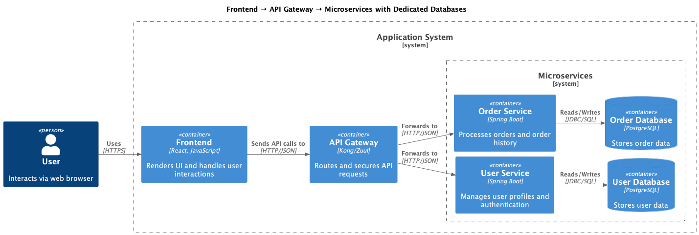
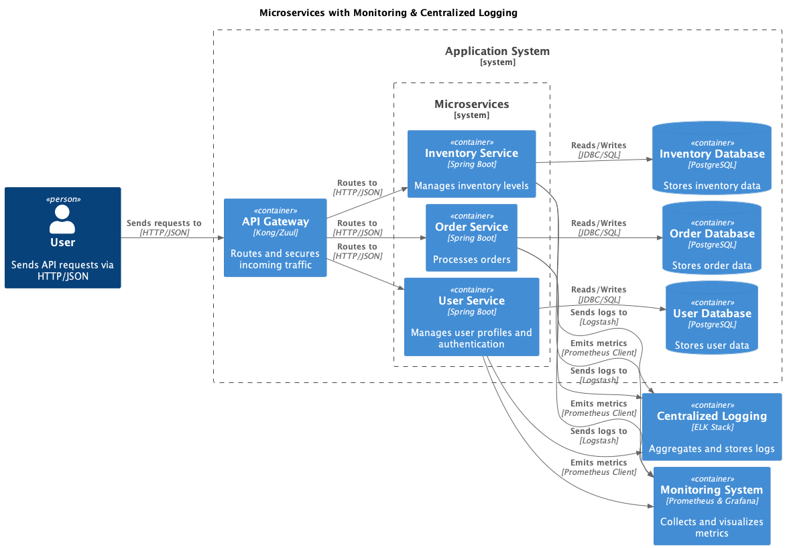

# Architecture Evolution - Incremental Steps

This section documents a step-by-step approach to evolve a simple application into a modern and distributed architecture. Each diagram represents a specific increment in the modernization journey.

## 1. Simple Monolithic Application

**Description:** Basic monolithic application with all functionalities in a single process, directly connected to a database.

- **Quality Score:** 3/10
- **Implementation Difficulty:** 1/10
- **Performance Level:** Low
- **When to Use:** MVPs, prototyping, very simple applications
- **Important Points:**
  - Fast initial development
  - Easy to test and deploy
  - Doesn't scale well
  - Difficult long-term maintenance

## 2. Frontend and Backend Separation

**Description:** First architectural separation dividing the application into frontend (UI) and backend (API + business logic).

- **Quality Score:** 5/10
- **Implementation Difficulty:** 3/10
- **Performance Level:** Low-Medium
- **When to Use:** Need for multiple clients, specialized frontend/backend teams
- **Important Points:**
  - Enables parallel development
  - Facilitates different client types
  - Still maintains monolithic backend
  - Foundation for future evolutions

## 3. Load Balancer Addition

**Description:** Introduction of load balancer to distribute traffic among multiple backend instances, improving availability and performance.

- **Quality Score:** 6/10
- **Implementation Difficulty:** 4/10
- **Performance Level:** Medium
- **When to Use:** Increased traffic, need for high availability
- **Important Points:**
  - Improves availability and throughput
  - Enables basic horizontal scalability
  - Requires session management
  - Introduces single point of failure in LB

## 4. Frontend and Backend Split

**Description:** Complete and independent separation between frontend and backend, each with its own lifecycle and deployment.

- **Quality Score:** 6/10
- **Implementation Difficulty:** 5/10
- **Performance Level:** Medium
- **When to Use:** Independent teams, need for independent releases
- **Important Points:**
  - Independent deployments
  - Layer-specific technologies
  - Need for API versioning
  - Communication complexity

## 5. API Gateway Introduction

**Description:** Implementation of API Gateway as central entry point, managing routing, authentication, and access policies.

- **Quality Score:** 7/10
- **Implementation Difficulty:** 6/10
- **Performance Level:** Medium-High
- **When to Use:** Multiple APIs, need for centralized policies, different client types
- **Important Points:**
  - Centralizes cross-cutting concerns
  - Facilitates versioning and routing
  - Can become bottleneck if poorly sized
  - Simplifies client integration

## 6. Split into 2 Microservices

**Description:** First decomposition of monolithic backend into two microservices based on distinct business domains.

- **Quality Score:** 7/10
- **Implementation Difficulty:** 7/10
- **Performance Level:** Medium-High
- **When to Use:** Well-defined domains, specialized teams, independent scalability
- **Important Points:**
  - Beginning of microservices architecture
  - Enables independent scalability
  - Inter-service communication complexity
  - Need for distributed tracing

## 7. Database per Microservice

**Description:** Implementation of the "database per service" pattern, where each microservice has its own dedicated database.

- **Quality Score:** 8/10
- **Implementation Difficulty:** 8/10
- **Performance Level:** High
- **When to Use:** Need for data isolation, domain-specific technologies
- **Important Points:**
  - Complete data isolation
  - Enables domain-specific optimization
  - Distributed transaction complexity
  - Need for eventual consistency

## 8. Adding 3rd Microservice - Inventory

**Description:** Architecture expansion with a third microservice dedicated to inventory management, demonstrating organic growth.

- **Quality Score:** 8/10
- **Implementation Difficulty:** 7/10
- **Performance Level:** High
- **When to Use:** Feature growth, need for domain specialization
- **Important Points:**
  - Demonstrates architecture scalability
  - Each service with specific responsibility
  - Increased orchestration complexity
  - Need for service discovery

## 9. Adding Cache Layer

**Description:** Implementation of distributed cache layer (Redis) for performance optimization and database load reduction.

- **Quality Score:** 8/10
- **Implementation Difficulty:** 6/10
- **Performance Level:** Very High
- **When to Use:** High read volume, need for low latency, resource optimization
- **Important Points:**
  - Significant latency reduction
  - Decreased database load
  - Cache invalidation complexity
  - Need for caching strategies

## 10. Message Broker for Asynchronous Events

**Description:** Introduction of message broker (Kafka/RabbitMQ) for asynchronous communication and event processing between microservices.

- **Quality Score:** 9/10
- **Implementation Difficulty:** 8/10
- **Performance Level:** Very High
- **When to Use:** Need for decoupling, asynchronous processing, event-driven architecture
- **Important Points:**
  - High decoupling between services
  - Better system resilience
  - Debugging complexity
  - Need for idempotency

## 11. gRPC Communication Between Services

**Description:** Implementation of gRPC for efficient synchronous communication between microservices, replacing REST where appropriate.

- **Quality Score:** 8/10
- **Implementation Difficulty:** 7/10
- **Performance Level:** Very High
- **When to Use:** Internal service communication, need for high performance, type safety
- **Important Points:**
  - Superior performance to REST
  - Type safety with Protocol Buffers
  - Better for internal communication
  - Learning curve for teams

## 12. Authentication Service

**Description:** Implementation of dedicated microservice for authentication and authorization, centralizing security and identity management.

- **Quality Score:** 9/10
- **Implementation Difficulty:** 8/10
- **Performance Level:** High
- **When to Use:** Multiple services, need for SSO, security compliance
- **Important Points:**
  - Centralization of security policies
  - Facilitates SSO implementation
  - Critical point of failure
  - Need for high availability

## 13. Database Replication for Scalability

**Description:** Implementation of master-slave replication in databases to improve read performance and availability.

- **Quality Score:** 8/10
- **Implementation Difficulty:** 7/10
- **Performance Level:** Very High
- **When to Use:** High read volume, need for high availability, geographic distribution
- **Important Points:**
  - Improves read performance
  - Increases availability
  - Consistency complexity
  - Need for read/write splitting

## 14. Monitoring and Logging

**Description:** Implementation of complete observability stack with monitoring, centralized logging, and alerts.

- **Quality Score:** 9/10
- **Implementation Difficulty:** 7/10
- **Performance Level:** High
- **When to Use:** Distributed systems, need for troubleshooting, strict SLAs
- **Important Points:**
  - Complete system visibility
  - Facilitates distributed debugging
  - Essential for operation
  - Can impact performance if misconfigured

## 15. Service Discovery

**Description:** Implementation of service discovery for automatic service location and dynamic load balancing.

- **Quality Score:** 8/10
- **Implementation Difficulty:** 6/10
- **Performance Level:** High
- **When to Use:** Multiple microservices, dynamic environments, auto-scaling
- **Important Points:**
  - Automatic service location
  - Facilitates deployment and scaling
  - Reduces manual configuration
  - Critical infrastructure point

## 16. Event-Driven Architecture Expansion

**Description:** Complete expansion to event-driven architecture with multiple messaging patterns and asynchronous processing.

- **Quality Score:** 9/10
- **Implementation Difficulty:** 9/10
- **Performance Level:** Very High
- **When to Use:** Complex systems, need for high scalability, real-time processing
- **Important Points:**
  - Maximum decoupling
  - Exceptional scalability
  - Debugging complexity
  - Need for advanced expertise

## 17. CDN for Frontend

**Description:** Integration of CDN (Content Delivery Network) for static content delivery optimization and user experience improvement.

- **Quality Score:** 8/10
- **Implementation Difficulty:** 4/10
- **Performance Level:** Very High
- **When to Use:** Geographically distributed users, static content, performance optimization
- **Important Points:**
  - Significant latency reduction
  - Improves user experience
  - Reduces server load
  - Additional CDN costs

## 18. Backend for Frontend (BFF)

**Description:** Implementation of BFF pattern to create specific and optimized APIs for different client types.

- **Quality Score:** 8/10
- **Implementation Difficulty:** 6/10
- **Performance Level:** High
- **When to Use:** Multiple client types, specific UI needs, payload optimization
- **Important Points:**
  - Client-optimized APIs
  - Reduces over-fetching
  - Possible code duplication
  - Significantly improves UX

## 19. Multi-Region Deployment

**Description:** Expansion to multi-region deployment for global high availability, disaster recovery and regional compliance.

- **Quality Score:** 9/10
- **Implementation Difficulty:** 10/10
- **Performance Level:** Very High
- **When to Use:** Global users, compliance requirements, disaster recovery
- **Important Points:**
  - Maximum global availability
  - Compliance with local regulations
  - Extreme operational complexity
  - High operational costs

## 20. Complete Modern Architecture

**Description:** Complete modern architecture integrating all patterns and practices: microservices, event-driven, observability, security and multi-region.

- **Quality Score:** 10/10
- **Implementation Difficulty:** 10/10
- **Performance Level:** Exceptional
- **When to Use:** Critical enterprise systems, high scale, complex requirements
- **Important Points:**
  - State of the art in architecture
  - Maximum flexibility and scalability
  - Requires highly specialized team
  - Significant ROI at large scale

---

## Implementation Guide

### Recommended Phases:

**Phase 1 - Foundation (Steps 1-5):**
- Basic separation of responsibilities
- Introduction of load balancing
- API Gateway as entry point

**Phase 2 - Microservices (Steps 6-9):**
- Decomposition into microservices
- Database per service
- Optimization with cache

**Phase 3 - Advanced Communication (Steps 10-12):**
- Event-driven architecture
- gRPC for internal communication
- Infrastructure services (Auth)

**Phase 4 - Operation and Scale (Steps 13-16):**
- Data replication
- Complete observability
- Service discovery
- Event-driven expansion

**Phase 5 - Global Optimization (Steps 17-20):**
- CDN and frontend optimization
- BFF for different clients
- Multi-region
- Complete architecture

### Decision Criteria:

1. **Team Size:** < 5 people = Steps 1-8
2. **Traffic Volume:** < 1M requests/day = Steps 1-12
3. **Business Complexity:** Simple = Steps 1-10
4. **Budget:** Limited = Steps 1-15
5. **Technical Expertise:** Basic = Steps 1-12

### Success Metrics by Phase:

- **Phase 1:** Availability > 99%, Deploy time < 30min
- **Phase 2:** Independent scalability, MTTR < 1h
- **Phase 3:** Throughput +300%, Latency -50%
- **Phase 4:** Complete observability, Auto-recovery
- **Phase 5:** Global scale, Availability > 99.99%