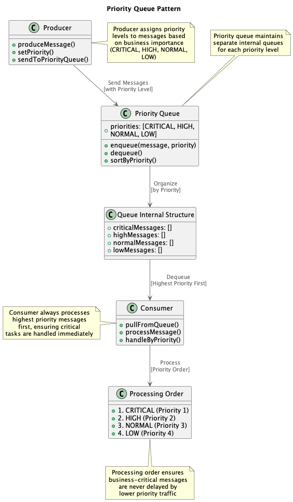

# Event-Driven Architecture and Messaging

This section documents patterns and solutions for event-based systems, message queues and asynchronous communication. The diagrams show from basic concepts to complex enterprise implementations.

## 1. Basic Producer-Consumer

**Description:** Fundamental messaging pattern with a producer sending messages directly to a consumer through a simple queue.

- **Quality Score:** 5/10
- **Implementation Difficulty:** 2/10
- **Performance Level:** Medium
- **When to Use:** Simple communication between two components, basic asynchronous processing
- **Important Points:**
  - Simplest messaging pattern
  - Direct coupling between producer and consumer
  - No redundancy or balancing
  - Base for more complex patterns

## 2. Producer with Queue

**Description:** Introduction of persistent queue between producer and consumer, enabling temporal decoupling and delivery guarantee.

- **Quality Score:** 6/10
- **Implementation Difficulty:** 3/10
- **Performance Level:** Medium
- **When to Use:** Need for message persistence, basic fault tolerance
- **Important Points:**
  - Temporal decoupling
  - Message persistence
  - Delivery guarantee
  - Possible bottleneck in single queue

## 3. Multiple Consumers

**Description:** Pattern with multiple consumers processing messages from the same queue, enabling parallelization and increased throughput.

- **Quality Score:** 7/10
- **Implementation Difficulty:** 4/10
- **Performance Level:** High
- **When to Use:** High message volume, need for parallel processing
- **Important Points:**
  - Increased throughput
  - Parallel processing
  - Need for idempotency
  - Automatic load balancing

## 4. Pub/Sub with Topic

**Description:** Implementation of Publish/Subscribe pattern using topics, allowing multiple subscribers to receive the same messages.

- **Quality Score:** 8/10
- **Implementation Difficulty:** 5/10
- **Performance Level:** High
- **When to Use:** Event broadcasting, multiple parties interested in the same information
- **Important Points:**
  - Complete decoupling
  - Natural broadcasting
  - Subscriber scalability
  - Topic management complexity

## 5. Load Balanced Consumers

**Description:** Implementation of intelligent load balancing between consumers, optimizing load distribution and performance.

- **Quality Score:** 8/10
- **Implementation Difficulty:** 6/10
- **Performance Level:** Very High
- **When to Use:** Intensive processing, need for resource optimization
- **Important Points:**
  - Optimized load distribution
  - Better resource utilization
  - Consumer fault tolerance
  - Balancing algorithm complexity

## 6. Dead Letter Queue

**Description:** Implementation of Dead Letter Queue for handling messages that failed processing, ensuring observability and recovery.

- **Quality Score:** 9/10
- **Implementation Difficulty:** 5/10
- **Performance Level:** High
- **When to Use:** Critical systems, need for failure auditing, message recovery
- **Important Points:**
  - Robust failure handling
  - Problem observability
  - Reprocessing capability
  - Need for DLQ monitoring

## 7. Fan-Out Pattern

**Description:** Fan-out pattern where a message is distributed to multiple specialized consumers, each processing different aspects.

- **Quality Score:** 8/10
- **Implementation Difficulty:** 6/10
- **Performance Level:** High
- **When to Use:** Specialized processing, parallel workflows, event sourcing
- **Important Points:**
  - Parallel specialized processing
  - Responsibility decoupling
  - Coordination complexity
  - Need for correlation IDs

## 8. Request-Reply Pattern

**Description:** Implementation of synchronous communication over asynchronous infrastructure, combining the best of both worlds.

- **Quality Score:** 7/10
- **Implementation Difficulty:** 7/10
- **Performance Level:** Medium-High
- **When to Use:** Need for synchronous response with messaging benefits
- **Important Points:**
  - Combines sync and async
  - Timeout and correlation handling
  - Implementation complexity
  - Useful for RPC over messaging

## 9. Multiple Producers

**Description:** Architecture with multiple producers sending messages to the same queue system, demonstrating input scalability.

- **Quality Score:** 7/10
- **Implementation Difficulty:** 5/10
- **Performance Level:** High
- **When to Use:** Multiple event sources, distributed systems, data aggregation
- **Important Points:**
  - Producer scalability
  - Natural event aggregation
  - Need for ordering guarantees
  - Possible queue contention

## 10. Message Router

**Description:** Implementation of intelligent message routing based on content, headers or business rules.

- **Quality Score:** 8/10
- **Implementation Difficulty:** 7/10
- **Performance Level:** High
- **When to Use:** Complex routing, multiple destinations, conditional processing
- **Important Points:**
  - Flexible and dynamic routing
  - Destination decoupling
  - Routing rule complexity
  - Logic-dependent performance

## 11. Kafka Partitioning

**Description:** Demonstration of Kafka partitioning for horizontal scalability and ordered parallel processing.

- **Quality Score:** 9/10
- **Implementation Difficulty:** 8/10
- **Performance Level:** Very High
- **When to Use:** High throughput, need for key-based ordering, horizontal scalability
- **Important Points:**
  - Massive horizontal scalability
  - Guaranteed ordering per partition
  - Rebalancing complexity
  - Kafka-specific expertise

## 12. Event-Driven Microservices

**Description:** Complete microservices architecture communicating through events, demonstrating total decoupling.

- **Quality Score:** 9/10
- **Implementation Difficulty:** 9/10
- **Performance Level:** Very High
- **When to Use:** Microservices architecture, need for maximum decoupling
- **Important Points:**
  - Complete decoupling between services
  - Independent scalability
  - Debugging complexity
  - Eventual consistency

## 13. Message Filter Pattern

**Description:** Implementation of message filters for selective processing based on specific criteria.

- **Quality Score:** 7/10
- **Implementation Difficulty:** 5/10
- **Performance Level:** High
- **When to Use:** Selective processing, resource optimization, conditional routing
- **Important Points:**
  - Efficient and selective processing
  - Reduction of unnecessary load
  - Criteria flexibility
  - Possible message loss if misconfigured

## 14. Priority Queue

**Description:** Implementation of priority queue for ordered processing by importance or urgency.

- **Quality Score:** 8/10
- **Implementation Difficulty:** 6/10
- **Performance Level:** High
- **When to Use:** Priority-based processing, differentiated SLAs, critical systems
- **Important Points:**
  - Processing by order of importance
  - Differentiated SLAs
  - Priority algorithm complexity
  - Possible low-priority starvation

## 15. Retry with Backoff

**Description:** Implementation of retry strategy with exponential backoff for robust handling of temporary failures.

- **Quality Score:** 9/10
- **Implementation Difficulty:** 6/10
- **Performance Level:** High
- **When to Use:** Distributed systems, temporary failures, external service integration
- **Important Points:**
  - Resilience to temporary failures
  - Avoids overloading systems with problems
  - Careful interval configuration
  - Need for circuit breaker

## 16. Saga Orchestration

**Description:** Implementation of Saga pattern for managing long-running distributed transactions.

- **Quality Score:** 9/10
- **Implementation Difficulty:** 9/10
- **Performance Level:** High
- **When to Use:** Distributed transactions, complex workflows, microservices
- **Important Points:**
  - Distributed transaction management
  - Automatic failure compensation
  - Implementation complexity
  - Need for idempotency

## 17. Event Sourcing

**Description:** Implementation of Event Sourcing where state is derived from an immutable sequence of events.

- **Quality Score:** 9/10
- **Implementation Difficulty:** 9/10
- **Performance Level:** High
- **When to Use:** Complete auditing, time travel, financial systems, CQRS
- **Important Points:**
  - Complete and immutable auditing
  - Time travel capability
  - Query complexity
  - Need for snapshots

## 18. CQRS with Messaging

**Description:** Implementation of CQRS (Command Query Responsibility Segregation) using messaging for synchronization between models.

- **Quality Score:** 9/10
- **Implementation Difficulty:** 9/10
- **Performance Level:** Very High
- **When to Use:** Different read/write needs, high performance, complex systems
- **Important Points:**
  - Independent read/write optimization
  - Exceptional scalability
  - Eventual consistency
  - High architectural complexity

## 19. Hybrid Kafka-Queue

**Description:** Hybrid architecture combining Kafka for high-volume events with traditional queues for specific processing.

- **Quality Score:** 9/10
- **Implementation Difficulty:** 8/10
- **Performance Level:** Very High
- **When to Use:** Different workload types, use case optimization
- **Important Points:**
  - Workload type optimization
  - Architectural flexibility
  - Management complexity
  - Multi-technology expertise

## 20. Enterprise Service Bus

**Description:** Complete Enterprise Service Bus implementation with all messaging patterns integrated for enterprise systems.

- **Quality Score:** 10/10
- **Implementation Difficulty:** 10/10
- **Performance Level:** Exceptional
- **When to Use:** Complex enterprise systems, multiple legacy system integration
- **Important Points:**
  - Complete enterprise integration
  - All messaging patterns
  - Maximum operational complexity
  - Significant ROI at large scale

---

## Pattern Selection Guide

### By Complexity:

**Beginner (1-5):**
- Basic Producer-Consumer
- Producer with queue
- Multiple consumers
- Simple Pub/Sub
- Load balanced consumers

**Intermediate (6-15):**
- Dead Letter Queue
- Fan-out pattern
- Request-Reply
- Message routing
- Priority queues
- Retry strategies

**Advanced (16-20):**
- Saga orchestration
- Event sourcing
- CQRS
- Hybrid architectures
- Enterprise service bus

### By Use Case:

**Simple Communication:** Patterns 1-3
**Broadcast/Notifications:** Patterns 4, 7, 12
**High Performance:** Patterns 11, 18, 19
**Distributed Transactions:** Patterns 16, 17
**Enterprise Systems:** Patterns 19, 20

### Recommended Technologies:

- **Apache Kafka:** Patterns 11, 12, 17, 18, 19
- **RabbitMQ:** Patterns 1-10, 13-16
- **Apache Pulsar:** Patterns 4, 7, 11, 12
- **Amazon SQS/SNS:** Patterns 1-6, 9, 13
- **Redis Streams:** Patterns 1-5, 9, 11

### Performance Metrics:

- **Throughput:** 1K-10M msgs/sec depending on pattern
- **Latency:** 1ms-100ms depending on complexity
- **Availability:** 99.9%-99.99% with advanced patterns
- **Durability:** Guaranteed with adequate persistence