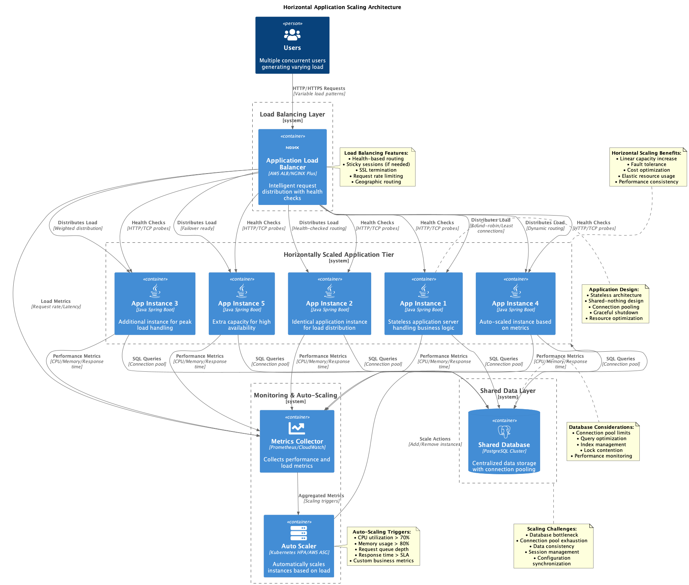
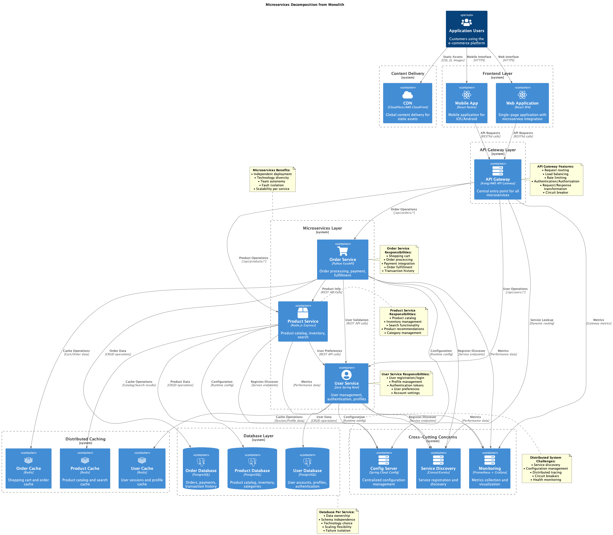
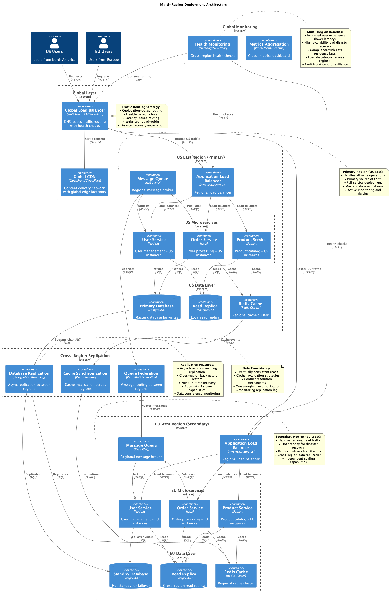
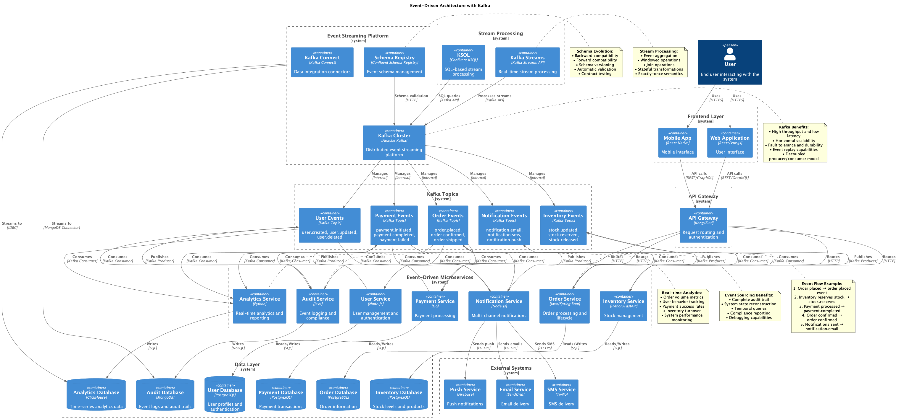
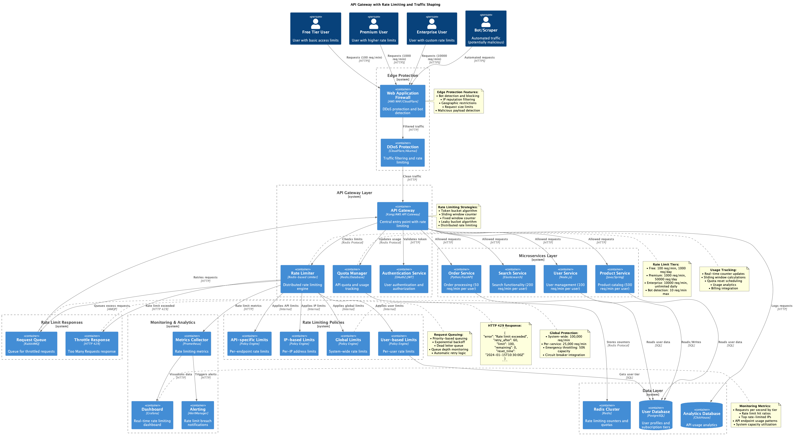

# Scalability and Performance - Patterns and Solutions

This section documents 20 diagrams focused on scalability patterns and performance optimization for distributed systems.

## Diagram Index

1. [Basic Monolithic Scaling](#1-basic-monolithic-scaling)
2. [Database Read Replicas](#2-database-read-replicas)
3. [Stateless Web Tier](#3-stateless-web-tier)
4. [Horizontal App Scaling](#4-horizontal-app-scaling)
5. [Adding Caching Layer](#5-adding-caching-layer)
6. [CDN Integration](#6-cdn-integration)
7. [Microservices Decomposition](#7-microservices-decomposition)
8. [Service Auto Scaling](#8-service-auto-scaling)
9. [Database Sharding](#9-database-sharding)
10. [Multi-Region Deployment](#10-multi-region-deployment)
11. [Event Driven Architecture](#11-event-driven-architecture)
12. [Caching Multiple Layers](#12-caching-multiple-layers)
13. [API Gateway Rate Limiting](#13-api-gateway-rate-limiting)
14. [Circuit Breaker Pattern](#14-circuit-breaker-pattern)
15. [Database Connection Pooling](#15-database-connection-pooling)
16. [Write Read Splitting](#16-write-read-splitting)
17. [Edge Computing Integration](#17-edge-computing-integration)
18. [Kubernetes Service Mesh](#18-kubernetes-service-mesh)
19. [Global Scalability Full](#19-global-scalability-full)

---

## 1. Basic Monolithic Scaling

**Description:** Initial scaling approach for monolithic applications using vertical scaling and basic load balancing techniques to handle increased traffic.

**Scores:**
- **Solution Quality:** 6/10
- **Implementation Difficulty:** 3/10
- **Performance Level:** Medium

**When to Use:**
- Legacy monolithic applications
- Small to medium-sized applications
- Quick scaling solutions
- Applications with limited architectural changes

**Important Points:**
- Limited scalability ceiling
- Single point of failure
- Easier to implement initially
- Cost-effective for small scale
- Consider migration path to microservices

---

## 2. Database Read Replicas

**Description:** Database scaling pattern that uses read replicas to distribute read queries across multiple database instances, reducing load on the primary database.

**Scores:**
- **Solution Quality:** 8/10
- **Implementation Difficulty:** 5/10
- **Performance Level:** High

**When to Use:**
- Read-heavy applications
- Applications with high query volume
- Systems requiring improved read performance
- Geographically distributed users

**Important Points:**
- Monitor replication lag
- Implement read/write splitting logic
- Consider eventual consistency
- Plan for replica failover
- Monitor replica performance

---

## 3. Stateless Web Tier

**Description:** Architecture pattern that removes session state from web servers, enabling horizontal scaling and improved fault tolerance.

**Scores:**
- **Solution Quality:** 9/10
- **Implementation Difficulty:** 6/10
- **Performance Level:** High

**When to Use:**
- Applications requiring horizontal scaling
- Cloud-native architectures
- Systems with high availability requirements
- Load-balanced environments

**Important Points:**
- Store session data externally (Redis, database)
- Design for stateless operations
- Implement proper session management
- Consider security implications
- Enable seamless load balancing

---

## 4. Horizontal App Scaling

**Description:** Scaling strategy that adds more application instances to handle increased load, distributing traffic across multiple servers.

**Scores:**
- **Solution Quality:** 8/10
- **Implementation Difficulty:** 5/10
- **Performance Level:** High

**When to Use:**
- Applications with variable traffic
- Cloud-native deployments
- Systems requiring elastic scaling
- Stateless application architectures

**Important Points:**
- Implement proper load balancing
- Ensure application statelessness
- Configure health checks
- Monitor resource utilization
- Plan for auto-scaling policies

---

## 5. Adding Caching Layer

**Description:** Performance optimization pattern that introduces caching mechanisms to reduce database load and improve response times.

**Scores:**
- **Solution Quality:** 9/10
- **Implementation Difficulty:** 6/10
- **Performance Level:** Very High

**When to Use:**
- Applications with repeated data access
- High-traffic systems
- Database-intensive operations
- Applications requiring fast response times

**Important Points:**
- Choose appropriate caching strategy
- Implement cache invalidation
- Monitor cache hit ratios
- Consider cache warming
- Plan for cache failures

---

## 6. CDN Integration

**Description:** Content delivery network integration that distributes static assets globally, reducing latency and improving user experience.

**Scores:**
- **Solution Quality:** 9/10
- **Implementation Difficulty:** 4/10
- **Performance Level:** Very High

**When to Use:**
- Global user base
- Static content heavy applications
- Applications requiring low latency
- High bandwidth requirements

**Important Points:**
- Configure proper cache headers
- Implement cache invalidation strategies
- Monitor CDN performance
- Consider costs vs benefits
- Optimize content for CDN delivery

---

## 7. Microservices Decomposition

**Description:** Architectural transformation from monolithic to microservices architecture, enabling independent scaling and deployment.

**Scores:**
- **Solution Quality:** 9/10
- **Implementation Difficulty:** 9/10
- **Performance Level:** High

**When to Use:**
- Large, complex applications
- Teams requiring independent deployment
- Systems with different scaling requirements
- Organizations adopting DevOps practices

**Important Points:**
- Define service boundaries carefully
- Implement proper communication patterns
- Plan for distributed system challenges
- Consider data consistency requirements
- Implement monitoring and observability

---

## 8. Service Auto Scaling

**Description:** Automated scaling system that adjusts service instances based on metrics like CPU, memory, or custom application metrics.

**Scores:**
- **Solution Quality:** 9/10
- **Implementation Difficulty:** 7/10
- **Performance Level:** High

**When to Use:**
- Variable traffic patterns
- Cost optimization requirements
- Cloud-native applications
- Microservices architectures

**Important Points:**
- Configure appropriate scaling metrics
- Set proper scaling thresholds
- Implement health checks
- Monitor scaling behavior
- Consider scaling delays and costs

---

## 9. Database Sharding

**Description:** Horizontal database partitioning technique that distributes data across multiple database instances to handle large datasets.

**Scores:**
- **Solution Quality:** 8/10
- **Implementation Difficulty:** 9/10
- **Performance Level:** Very High

**When to Use:**
- Large datasets exceeding single server capacity
- High write throughput requirements
- Applications requiring horizontal database scaling
- Systems with natural data partitioning

**Important Points:**
- Choose sharding key carefully
- Avoid hot spots
- Implement query routing
- Plan for rebalancing
- Consider cross-shard operations complexity

---

## 10. Multi-Region Deployment

**Description:** Geographic distribution of application infrastructure across multiple regions for improved performance and disaster recovery.

**Scores:**
- **Solution Quality:** 9/10
- **Implementation Difficulty:** 8/10
- **Performance Level:** Very High

**When to Use:**
- Global user base
- High availability requirements
- Disaster recovery needs
- Compliance with data residency laws

**Important Points:**
- Implement data synchronization strategies
- Consider network latency between regions
- Plan for regional failures
- Monitor cross-region performance
- Implement proper routing policies

---

## 11. Event Driven Architecture

**Description:** Architectural pattern using events to trigger and communicate between decoupled services, enabling scalable and resilient systems.

**Scores:**
- **Solution Quality:** 9/10
- **Implementation Difficulty:** 8/10
- **Performance Level:** High

**When to Use:**
- Loosely coupled systems
- Real-time processing requirements
- Complex business workflows
- Systems requiring high scalability

**Important Points:**
- Design event schemas carefully
- Implement proper event ordering
- Handle duplicate events (idempotency)
- Monitor event processing
- Plan for event store scalability

---

## 12. Caching Multiple Layers

**Description:** Multi-tier caching strategy implementing cache at different levels (browser, CDN, application, database) for maximum performance.

**Scores:**
- **Solution Quality:** 10/10
- **Implementation Difficulty:** 8/10
- **Performance Level:** Very High

**When to Use:**
- High-performance applications
- Global user base
- Complex data access patterns
- Applications with strict latency requirements

**Important Points:**
- Coordinate cache invalidation across layers
- Set appropriate TTL for each layer
- Monitor cache hit ratios
- Implement cache warming strategies
- Consider cache consistency requirements

---

## 13. API Gateway Rate Limiting

**Description:** Traffic control mechanism that limits the number of requests to prevent system overload and ensure fair resource usage.

**Scores:**
- **Solution Quality:** 8/10
- **Implementation Difficulty:** 6/10
- **Performance Level:** High

**When to Use:**
- Public APIs
- Systems with resource constraints
- Multi-tenant applications
- Protection against abuse

**Important Points:**
- Implement different rate limiting algorithms
- Configure limits per client/endpoint
- Provide clear error messages
- Monitor rate limiting effectiveness
- Consider burst capacity

---

## 14. Circuit Breaker Pattern

**Description:** Fault tolerance pattern that prevents cascading failures by monitoring service health and failing fast when issues are detected.

**Scores:**
- **Solution Quality:** 9/10
- **Implementation Difficulty:** 7/10
- **Performance Level:** High

**When to Use:**
- Microservices architectures
- Systems with external dependencies
- Applications requiring high resilience
- Services with variable response times

**Important Points:**
- Configure appropriate failure thresholds
- Implement fallback mechanisms
- Monitor circuit breaker states
- Plan for gradual recovery
- Consider timeout configurations

---

## 15. Database Connection Pooling

**Description:** Resource management technique that maintains a pool of reusable database connections to improve performance and resource utilization.

**Scores:**
- **Solution Quality:** 8/10
- **Implementation Difficulty:** 5/10
- **Performance Level:** High

**When to Use:**
- High-concurrency applications
- Database-intensive operations
- Applications with frequent database connections
- Resource-constrained environments

**Important Points:**
- Configure optimal pool size
- Implement connection validation
- Monitor pool utilization
- Handle connection leaks
- Set appropriate timeouts

---

## 16. Write Read Splitting

**Description:** Database architecture pattern that separates write and read operations to different database instances for improved performance.

**Scores:**
- **Solution Quality:** 8/10
- **Implementation Difficulty:** 6/10
- **Performance Level:** High

**When to Use:**
- Read-heavy applications
- Systems with different read/write performance requirements
- Applications requiring read scaling
- Systems with analytical workloads

**Important Points:**
- Implement proper routing logic
- Handle replication lag
- Monitor read/write performance separately
- Consider eventual consistency
- Plan for failover scenarios

---

## 17. Edge Computing Integration

**Description:** Distributed computing approach that brings computation closer to users by deploying services at edge locations.

**Scores:**
- **Solution Quality:** 9/10
- **Implementation Difficulty:** 8/10
- **Performance Level:** Very High

**When to Use:**
- IoT applications
- Real-time processing requirements
- Applications requiring ultra-low latency
- Bandwidth-constrained environments

**Important Points:**
- Design for distributed deployment
- Implement data synchronization
- Consider edge resource constraints
- Monitor edge node performance
- Plan for connectivity issues

---

## 18. Kubernetes Service Mesh

**Description:** Infrastructure layer that handles service-to-service communication with features like load balancing, security, and observability.

**Scores:**
- **Solution Quality:** 9/10
- **Implementation Difficulty:** 8/10
- **Performance Level:** High

**When to Use:**
- Complex microservices architectures
- Kubernetes-based deployments
- Systems requiring advanced traffic management
- Applications needing comprehensive observability

**Important Points:**
- Consider performance overhead
- Implement proper security policies
- Monitor service mesh metrics
- Plan for service mesh upgrades
- Configure traffic routing policies

---

## 19. Global Scalability Full

**Description:** Comprehensive global architecture combining multiple scalability patterns for maximum performance and availability worldwide.

**Scores:**
- **Solution Quality:** 10/10
- **Implementation Difficulty:** 10/10
- **Performance Level:** Very High

**When to Use:**
- Large-scale global applications
- Enterprise systems with strict SLAs
- Applications with massive user bases
- Systems requiring maximum performance

**Important Points:**
- Integrate multiple scaling patterns
- Implement comprehensive monitoring
- Plan for complex operational requirements
- Consider significant infrastructure costs
- Require experienced engineering teams

---

## Selection Guide by Scenario

### High Performance
- **CDN Integration** - Global static content delivery
- **Caching Multiple Layers** - Maximum performance optimization
- **Edge Computing Integration** - Ultra-low latency requirements
- **Global Scalability Full** - Comprehensive performance solution

### High Availability
- **Multi-Region Deployment** - Geographic redundancy
- **Circuit Breaker Pattern** - Fault tolerance
- **Kubernetes Service Mesh** - Advanced traffic management
- **Event Driven Architecture** - Resilient system design

### Scalability
- **Database Sharding** - Large dataset handling
- **Service Auto Scaling** - Automatic capacity adjustment
- **Microservices Decomposition** - Independent service scaling
- **Horizontal App Scaling** - Linear scaling capability

### Cost Optimization
- **Service Auto Scaling** - Pay-as-you-use scaling
- **Basic Monolithic Scaling** - Simple, cost-effective approach
- **Database Read Replicas** - Efficient read scaling
- **Adding Caching Layer** - Reduce expensive database calls

## Implementation Complexity

### Low Complexity (1-4/10)
- **Basic Monolithic Scaling** - Simple vertical scaling
- **CDN Integration** - Straightforward content delivery
- **Adding Caching Layer** - Basic caching implementation
- **Database Connection Pooling** - Standard connection management

### Medium Complexity (5-7/10)
- **Database Read Replicas** - Read/write splitting
- **Stateless Web Tier** - Session management changes
- **Horizontal App Scaling** - Load balancing setup
- **API Gateway Rate Limiting** - Traffic control implementation

### High Complexity (8-10/10)
- **Database Sharding** - Complex data partitioning
- **Microservices Decomposition** - Architectural transformation
- **Multi-Region Deployment** - Geographic distribution
- **Global Scalability Full** - Comprehensive solution

## Performance Levels

### Very High Performance
- **CDN Integration** - Global content delivery
- **Caching Multiple Layers** - Multi-tier optimization
- **Edge Computing Integration** - Ultra-low latency
- **Database Sharding** - Massive data handling

### High Performance
- **Service Auto Scaling** - Dynamic capacity
- **Circuit Breaker Pattern** - Resilient performance
- **Write Read Splitting** - Optimized database access
- **Kubernetes Service Mesh** - Advanced traffic management

### Medium Performance
- **Basic Monolithic Scaling** - Limited scaling capability
- **Database Connection Pooling** - Connection efficiency
- **Stateless Web Tier** - Improved scalability foundation

---

*Original files available at: `diagrams/scalability-performance/`*
*Generated diagrams available at: `docs/generated-diagrams/scalability-performance/`*