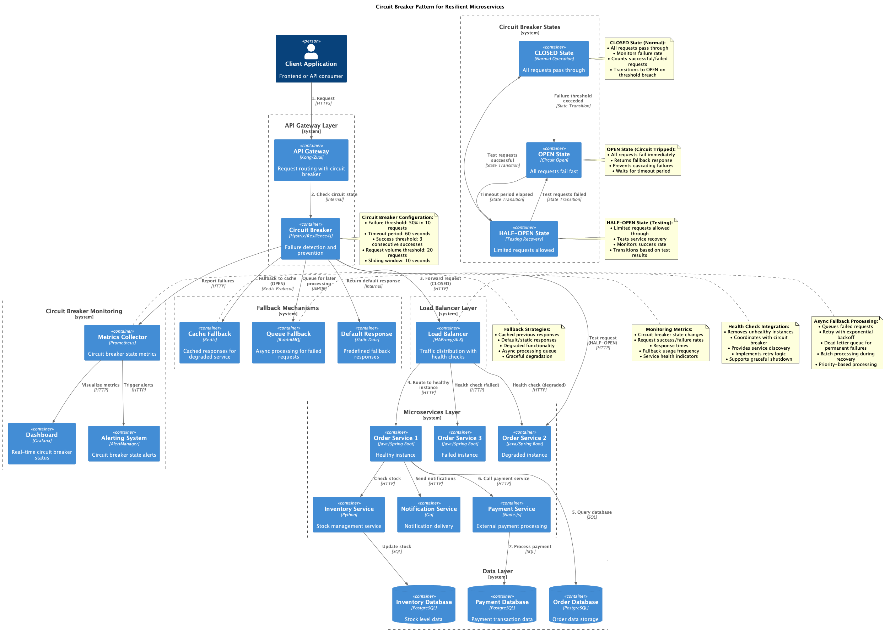

# Scalability and Performance - Patterns and Solutions

This section documents 20 diagrams focused on scalability patterns and performance optimization for distributed systems.

## Diagram Index

1. [Auto Scaling Groups](#1-auto-scaling-groups)
2. [Blue-Green Deployment](#2-blue-green-deployment)
3. [Canary Deployment](#3-canary-deployment)
4. [CDN Distribution](#4-cdn-distribution)
5. [Circuit Breaker Pattern](#5-circuit-breaker-pattern)
6. [Connection Pooling](#6-connection-pooling)
7. [Database Sharding](#7-database-sharding)
8. [Elastic Load Balancing](#8-elastic-load-balancing)
9. [Horizontal Pod Autoscaler](#9-horizontal-pod-autoscaler)
10. [In-Memory Caching](#10-in-memory-caching)
11. [Load Balancer Types](#11-load-balancer-types)
12. [Multi-Layer Caching](#12-multi-layer-caching)
13. [Multi-Layer Caching (Detailed)](#13-multi-layer-caching-detailed)
14. [Read Replicas](#14-read-replicas)
15. [Circuit Breaker Pattern (Advanced)](#15-circuit-breaker-pattern-advanced)
16. [Database Connection Pooling](#16-database-connection-pooling)
17. [Redis Cluster](#17-redis-cluster)
18. [Rolling Updates](#18-rolling-updates)
19. [Service Mesh](#19-service-mesh)
20. [Vertical Scaling](#20-vertical-scaling)

---

## 1. Auto Scaling Groups

**Description:** Implementation of auto scaling groups that automatically adjust resource capacity based on demand, using metrics like CPU, memory, and requests per second.

**Scores:**
- **Solution Quality:** 9/10
- **Implementation Difficulty:** 6/10
- **Performance Level:** High

**When to Use:**
- Applications with significant traffic variation
- Systems that need to optimize costs automatically
- Cloud-native architectures requiring elasticity
- Workloads with predictable demand patterns

**Important Points:**
- Configure appropriate scaling metrics (CPU, memory, custom metrics)
- Define balanced scale-up and scale-down policies
- Implement robust health checks
- Consider warm-up time for new instances
- Monitor costs and optimize thresholds

---

## 2. Blue-Green Deployment

**Description:** Deployment strategy that maintains two identical environments (blue and green), enabling zero-downtime deployments and instant rollback in case of issues.

**Scores:**
- **Solution Quality:** 9/10
- **Implementation Difficulty:** 7/10
- **Performance Level:** High

**When to Use:**
- Critical applications that cannot have downtime
- Systems requiring fast rollback
- Production environments with high availability
- Stateless application deployments

**Important Points:**
- Requires double resources during deployment
- Needs data synchronization between environments
- Implement smoke tests before switching
- Configure load balancer for fast switching
- Maintain well-defined rollback strategy

---

## 3. Canary Deployment

**Description:** Gradual deployment strategy that directs a small percentage of traffic to the new version, enabling production validation with controlled risk.

**Scores:**
- **Solution Quality:** 8/10
- **Implementation Difficulty:** 7/10
- **Performance Level:** High

**When to Use:**
- Critical feature deployments
- Systems with large user base
- Applications requiring production validation
- Environments where bug impact must be minimized

**Important Points:**
- Configure percentage-based traffic routing
- Implement detailed metrics monitoring
- Define clear success/failure criteria
- Automate rollback based on alerts
- Consider user segmentation for canary

---

## 4. CDN Distribution

**Description:** Content distribution network that stores static assets in multiple geographic locations, reducing latency and improving global performance.

**Scores:**
- **Solution Quality:** 9/10
- **Implementation Difficulty:** 4/10
- **Performance Level:** Very High

**When to Use:**
- Applications with globally distributed users
- Sites with lots of static content (images, CSS, JS)
- Applications requiring low latency
- Systems with high download volume

**Important Points:**
- Configure appropriate cache headers
- Implement efficient cache invalidation
- Monitor hit ratio and performance by region
- Consider bandwidth costs
- Configure SSL/TLS properly

---

## 5. Circuit Breaker Pattern

**Description:** Pattern that prevents failure cascades in distributed systems, interrupting calls to failing services and enabling gradual recovery.

**Scores:**
- **Solution Quality:** 9/10
- **Implementation Difficulty:** 6/10
- **Performance Level:** High

**When to Use:**
- Microservices architectures
- Systems with external dependencies
- Applications making frequent network calls
- Environments where cascade failures are critical

**Important Points:**
- Configure appropriate failure thresholds
- Implement adequate timeout
- Define fallback strategies
- Monitor circuit breaker states
- Consider half-open state for recovery

---

## 6. Connection Pooling

**Description:** Technique that maintains a pool of reusable database connections, reducing connection creation/destruction overhead and improving performance.

**Scores:**
- **Solution Quality:** 8/10
- **Implementation Difficulty:** 5/10
- **Performance Level:** High

**When to Use:**
- Applications with high query frequency
- Systems with multiple simultaneous connections
- Environments where connection latency is critical
- Applications performing many database operations

**Important Points:**
- Configure pool size appropriately
- Implement timeout for idle connections
- Monitor pool utilization
- Configure max connections on database
- Consider connection validation

---

## 7. Database Sharding

**Description:** Horizontal partitioning technique that distributes data across multiple databases, enabling scalability beyond single server limits.

**Scores:**
- **Solution Quality:** 8/10
- **Implementation Difficulty:** 9/10
- **Performance Level:** Very High

**When to Use:**
- Datasets exceeding single server capacity
- Applications with high write load
- Systems requiring horizontal scalability
- Cases where natural partitioning exists

**Important Points:**
- Choose sharding key carefully
- Avoid hot spots and uneven distribution
- Implement query routing
- Consider cross-shard join complexity
- Plan rebalancing strategy

---

## 8. Elastic Load Balancing

**Description:** Load balancing system that automatically adapts to demand, distributing traffic across multiple instances and adjusting capacity as needed.

**Scores:**
- **Solution Quality:** 9/10
- **Implementation Difficulty:** 5/10
- **Performance Level:** High

**When to Use:**
- Applications with variable traffic
- Systems requiring high availability
- Multi-zone or multi-region architectures
- Applications with multiple instances

**Important Points:**
- Configure appropriate health checks
- Choose adequate balancing algorithm
- Implement sticky sessions if necessary
- Monitor load distribution
- Configure SSL termination properly

---

## 9. Horizontal Pod Autoscaler

**Description:** Kubernetes controller that automatically adjusts the number of pods based on metrics like CPU, memory, or custom metrics.

**Scores:**
- **Solution Quality:** 9/10
- **Implementation Difficulty:** 6/10
- **Performance Level:** High

**When to Use:**
- Containerized applications in Kubernetes
- Workloads with variable demand
- Systems needing resource optimization
- Stateless applications that can scale horizontally

**Important Points:**
- Configure resource requests/limits appropriately
- Define appropriate scaling metrics
- Implement readiness/liveness probes
- Consider PodDisruptionBudget
- Monitor scaling behavior

---

## 10. In-Memory Caching

**Description:** Caching system that stores frequently accessed data in RAM, providing extremely fast access and reducing database load.

**Scores:**
- **Solution Quality:** 8/10
- **Implementation Difficulty:** 5/10
- **Performance Level:** Very High

**When to Use:**
- Frequently accessed data
- Computationally expensive queries
- Applications with high database latency
- Systems requiring fast response

**Important Points:**
- Implement invalidation strategy
- Configure appropriate TTL
- Monitor hit ratio and memory usage
- Consider cache warming strategies
- Implement fallback for cache miss

---

## 11. Load Balancer Types

**Description:** Comparison between different load balancer types (Layer 4, Layer 7, Application Load Balancer) and their specific use cases.

**Scores:**
- **Solution Quality:** 8/10
- **Implementation Difficulty:** 6/10
- **Performance Level:** High

**When to Use:**
- Architectures requiring traffic distribution
- Systems with multiple backends
- Applications needing intelligent routing
- Environments with specific balancing requirements

**Important Points:**
- Choose type based on specific requirements
- Configure appropriate balancing algorithms
- Implement robust health checks
- Consider latency vs functionality
- Monitor performance and distribution

---

## 12. Multi-Layer Caching

**Description:** Multi-layer caching architecture (browser, CDN, application, database) that optimizes performance through hierarchical storage strategy.

**Scores:**
- **Solution Quality:** 9/10
- **Implementation Difficulty:** 7/10
- **Performance Level:** Very High

**When to Use:**
- Applications with different data types
- Systems with globally distributed users
- Architectures requiring maximum optimization
- Applications with varied access patterns

**Important Points:**
- Define coordinated invalidation strategy
- Configure appropriate TTL for each layer
- Implement cache coherence
- Monitor hit ratio per layer
- Consider debugging complexity

---

## 13. Multi-Layer Caching (Detailed)

**Description:** Detailed version of multi-layer caching architecture, showing specific flows, cache policies and synchronization strategies between layers.

**Scores:**
- **Solution Quality:** 9/10
- **Implementation Difficulty:** 8/10
- **Performance Level:** Very High

**When to Use:**
- Enterprise systems with high complexity
- Applications with strict performance SLA
- Architectures processing large volumes
- Environments with multiple workload types

**Important Points:**
- Implement coordinated cache warming
- Configure eviction policies per layer
- Monitor consistency between layers
- Define fallback strategies
- Consider cold start impact

---

## 14. Read Replicas

**Description:** Read replica configuration that distributes query requests among multiple database instances, reducing load on master and improving performance.

**Scores:**
- **Solution Quality:** 8/10
- **Implementation Difficulty:** 6/10
- **Performance Level:** High

**When to Use:**
- Read-heavy applications
- Systems with high query proportion
- Architectures requiring read/write separation
- Environments with geographically distributed users

**Important Points:**
- Configure replication lag monitoring
- Implement read/write splitting
- Consider eventual consistency
- Monitor replica performance
- Plan failover strategy

---

## 15. Circuit Breaker Pattern (Advanced)

**Description:** Advanced Circuit Breaker pattern implementation with multiple states, detailed metrics and sophisticated recovery and fallback strategies.

**Scores:**
- **Solution Quality:** 9/10
- **Implementation Difficulty:** 7/10
- **Performance Level:** High

**When to Use:**
- Microservices with critical dependencies
- Systems with strict SLA
- Architectures requiring high resilience
- Environments with multiple failure points

**Important Points:**
- Implement granular metrics
- Configure adaptive thresholds
- Define sophisticated fallback strategies
- Monitor states in real time
- Consider circuit breaker per-endpoint

---

## 16. Database Connection Pooling

**Description:** Detailed connection pooling implementation with advanced configurations, metrics monitoring and performance optimization strategies.

**Scores:**
- **Solution Quality:** 8/10
- **Implementation Difficulty:** 6/10
- **Performance Level:** High

**When to Use:**
- Applications with high concurrency
- Systems with multiple simultaneous connections
- Architectures requiring resource optimization
- Environments with connection limitations

**Important Points:**
- Configure pool size based on workload
- Implement connection validation
- Monitor pool utilization
- Configure appropriate timeouts
- Consider connection leaks

---

## 17. Redis Cluster

**Description:** Redis cluster configuration for high availability and scalability, with automatic sharding and replication between nodes.

**Scores:**
- **Solution Quality:** 9/10
- **Implementation Difficulty:** 7/10
- **Performance Level:** Very High

**When to Use:**
- High performance distributed cache
- Systems requiring low latency
- Applications with large cached datasets
- Architectures needing high availability

**Important Points:**
- Configure adequate sharding strategy
- Implement cluster health monitoring
- Plan backup strategy
- Configure replication factor
- Monitor memory usage per node

---

## 18. Rolling Updates

**Description:** Deployment strategy that updates instances gradually, maintaining service availability throughout the entire update process.

**Scores:**
- **Solution Quality:** 8/10
- **Implementation Difficulty:** 6/10
- **Performance Level:** High

**When to Use:**
- Applications that cannot have downtime
- Systems with multiple instances
- Frequent deployments
- Critical production environments

**Important Points:**
- Configure adequate update strategy
- Implement health checks during update
- Define automatic rollback
- Monitor performance during deployment
- Consider backward compatibility

---

## 19. Service Mesh

**Description:** Dedicated infrastructure for service-to-service communication, providing observability, security, and traffic control without modifying application code.

**Scores:**
- **Solution Quality:** 9/10
- **Implementation Difficulty:** 8/10
- **Performance Level:** High

**When to Use:**
- Complex microservices architectures
- Systems requiring detailed observability
- Environments with strict security requirements
- Applications with multiple communication protocols

**Important Points:**
- Configure sidecar proxy properly
- Implement traffic policies
- Monitor additional latency
- Configure mTLS between services
- Consider resource overhead

---

## 20. Vertical Scaling

**Description:** Scalability strategy that increases resources (CPU, memory, storage) of an existing instance to handle greater demand.

**Scores:**
- **Solution Quality:** 6/10
- **Implementation Difficulty:** 4/10
- **Performance Level:** Medium

**When to Use:**
- Monolithic applications
- Systems with architectural limitations
- Workloads that cannot be distributed
- Temporary or short-term solutions

**Important Points:**
- Identify maximum hardware limits
- Plan downtime for upgrades
- Monitor resource utilization
- Consider cost vs benefit
- Evaluate migration to horizontal scaling

---

## Selection Guide by Scenario

### High Performance
- **CDN Distribution** - For global static content
- **Multi-Layer Caching** - For maximum optimization
- **Redis Cluster** - For distributed cache
- **In-Memory Caching** - For frequent data

### High Availability
- **Blue-Green Deployment** - For zero downtime
- **Circuit Breaker Pattern** - For resilience
- **Service Mesh** - For observability
- **Auto Scaling Groups** - For elasticity

### Scalability
- **Database Sharding** - For large datasets
- **Horizontal Pod Autoscaler** - For Kubernetes
- **Elastic Load Balancing** - For distribution
- **Read Replicas** - For read-heavy workloads

### Safe Deployment
- **Canary Deployment** - For gradual validation
- **Rolling Updates** - For zero-downtime updates
- **Circuit Breaker** - For failure prevention

## Performance Metrics

### Latency
- **Very Low (<10ms):** In-Memory Caching, CDN
- **Low (<100ms):** Redis Cluster, Multi-Layer Caching
- **Medium (<500ms):** Connection Pooling, Load Balancing
- **Acceptable (<1s):** Database Sharding, Read Replicas

### Throughput
- **Very High (>10k RPS):** CDN, Multi-Layer Caching
- **High (1k-10k RPS):** Redis Cluster, Load Balancing
- **Medium (100-1k RPS):** Connection Pooling, Auto Scaling
- **Low (<100 RPS):** Vertical Scaling

### Availability
- **99.99%+:** Blue-Green, Service Mesh, Circuit Breaker
- **99.9%+:** Auto Scaling, Load Balancing, Rolling Updates
- **99%+:** Read Replicas, Connection Pooling
- **95%+:** Vertical Scaling, Canary Deployment

---

*Original files available at: `diagrams/scalability-performance/`*
*Generated diagrams available at: `docs/generated-diagrams/scalability-performance/`*