# Security and Compliance - Patterns and Solutions

This section documents 20 diagrams focused on security patterns, compliance, and data protection for distributed systems.

## Diagram Index

1. [API Gateway Security](#1-api-gateway-security)
2. [Certificate Management](#2-certificate-management)
3. [Data Encryption](#3-data-encryption)
4. [DDoS Protection](#4-ddos-protection)
5. [Identity Provider Integration](#5-identity-provider-integration)
6. [JWT Token Flow](#6-jwt-token-flow)
7. [Multi-Factor Authentication](#7-multi-factor-authentication)
8. [Network Segmentation](#8-network-segmentation)
9. [OAuth2 Flow](#9-oauth2-flow)
10. [PCI DSS Compliance](#10-pci-dss-compliance)
11. [Role-Based Access Control](#11-role-based-access-control)
12. [SAML Authentication](#12-saml-authentication)
13. [Secrets Management](#13-secrets-management)
14. [Security Monitoring](#14-security-monitoring)
15. [SSL/TLS Termination](#15-ssltls-termination)
16. [Threat Detection](#16-threat-detection)
17. [VPN Gateway](#17-vpn-gateway)
18. [WAF Protection](#18-waf-protection)
19. [Zero Trust Architecture](#19-zero-trust-architecture)
20. [Compliance Audit Trail](#20-compliance-audit-trail)

---

## 1. API Gateway Security

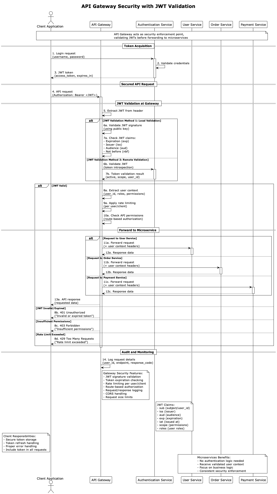

**Description:** API Gateway security implementation with authentication, authorization, rate limiting, request validation, and protection against common attacks.

**Scores:**
- **Solution Quality:** 9/10
- **Implementation Difficulty:** 6/10
- **Performance Level:** High

**When to Use:**
- Externally exposed microservices architectures
- Public APIs requiring access control
- Systems needing rate limiting and throttling
- Environments requiring API call auditing

**Important Points:**
- Implement robust authentication (OAuth2, JWT)
- Configure rate limiting per client/endpoint
- Validate all input data
- Monitor suspicious access attempts
- Maintain detailed logs for auditing

---

## 2. Certificate Management

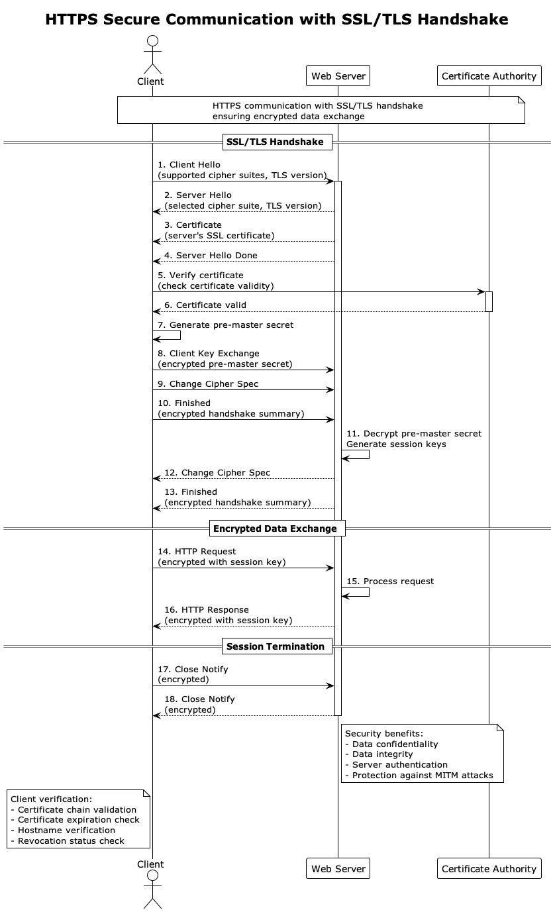

**Description:** Digital certificate management system with automatic renewal, secure distribution, and expiration monitoring.

**Scores:**
- **Solution Quality:** 8/10
- **Implementation Difficulty:** 7/10
- **Performance Level:** Medium

**When to Use:**
- Environments with multiple SSL/TLS certificates
- Systems requiring PKI (Public Key Infrastructure)
- Applications with mTLS communication
- Organizations with strict certification policies

**Important Points:**
- Automate certificate renewal
- Implement expiration alerts
- Maintain secure backup of private keys
- Configure automatic distribution
- Monitor certificate status in real-time

---

## 3. Data Encryption

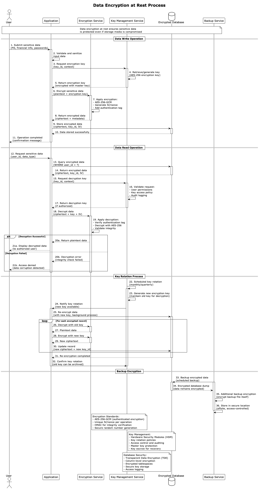

**Description:** End-to-end encryption implementation for data in transit and at rest, including key management and secure algorithms.

**Scores:**
- **Solution Quality:** 9/10
- **Implementation Difficulty:** 8/10
- **Performance Level:** Medium

**When to Use:**
- Sensitive data (PII, financial, medical)
- Systems requiring regulatory compliance
- Applications with strict privacy requirements
- Multi-tenant environments with data isolation

**Important Points:**
- Use approved encryption algorithms (AES-256)
- Implement regular key rotation
- Separate data from encryption keys
- Configure encryption at rest and in transit
- Maintain key access auditing

---

## 4. DDoS Protection

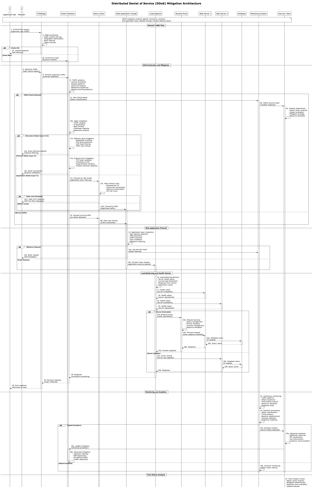

**Description:** DDoS attack protection system with multiple defense layers, automatic detection, and real-time mitigation.

**Scores:**
- **Solution Quality:** 9/10
- **Implementation Difficulty:** 7/10
- **Performance Level:** High

**When to Use:**
- Public web applications
- Business-critical services
- High-visibility APIs
- Systems that are frequent attack targets

**Important Points:**
- Configure aggressive rate limiting
- Implement anomalous pattern detection
- Use CDN with integrated DDoS protection
- Configure automatic blacklisting
- Maintain incident response plan

---

## 5. Identity Provider Integration

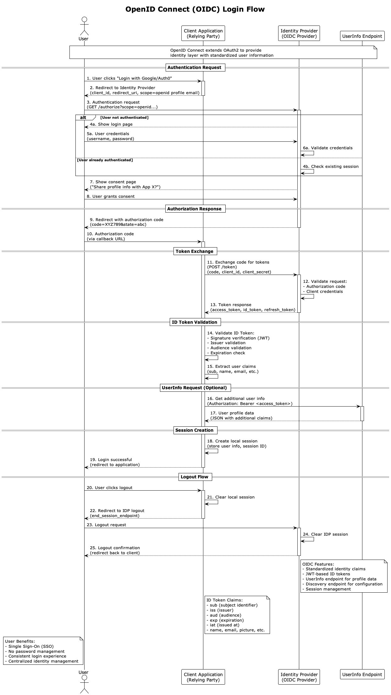

**Description:** Integration with external identity providers (Active Directory, LDAP, Social Login) for centralized authentication and SSO.

**Scores:**
- **Solution Quality:** 8/10
- **Implementation Difficulty:** 6/10
- **Performance Level:** High

**When to Use:**
- Organizations with existing corporate identities
- Applications requiring SSO
- Multi-application systems
- Environments needing centralized user management

**Important Points:**
- Configure appropriate attribute mapping
- Implement fallback for IdP failures
- Maintain group/role synchronization
- Configure appropriate token timeout
- Monitor authentication attempts

---

## 6. JWT Token Flow

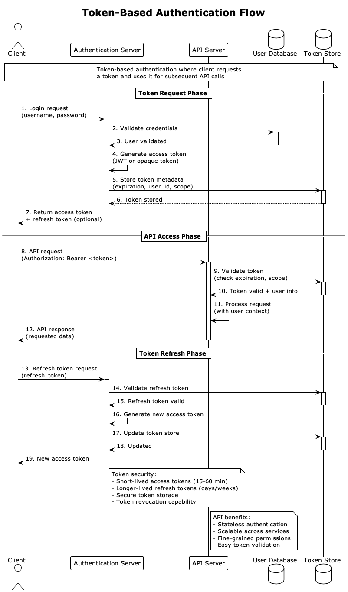

**Description:** JWT (JSON Web Token) flow implementation for stateless authentication with validation, refresh tokens, and adequate security.

**Scores:**
- **Solution Quality:** 8/10
- **Implementation Difficulty:** 5/10
- **Performance Level:** High

**When to Use:**
- Stateless RESTful APIs
- SPA (Single Page Application) applications
- Microservices requiring authentication
- Distributed systems without shared sessions

**Important Points:**
- Use secure signing algorithms (RS256)
- Configure appropriate token expiration
- Implement refresh token rotation
- Validate mandatory claims
- Maintain blacklist of revoked tokens

---

## 7. Multi-Factor Authentication

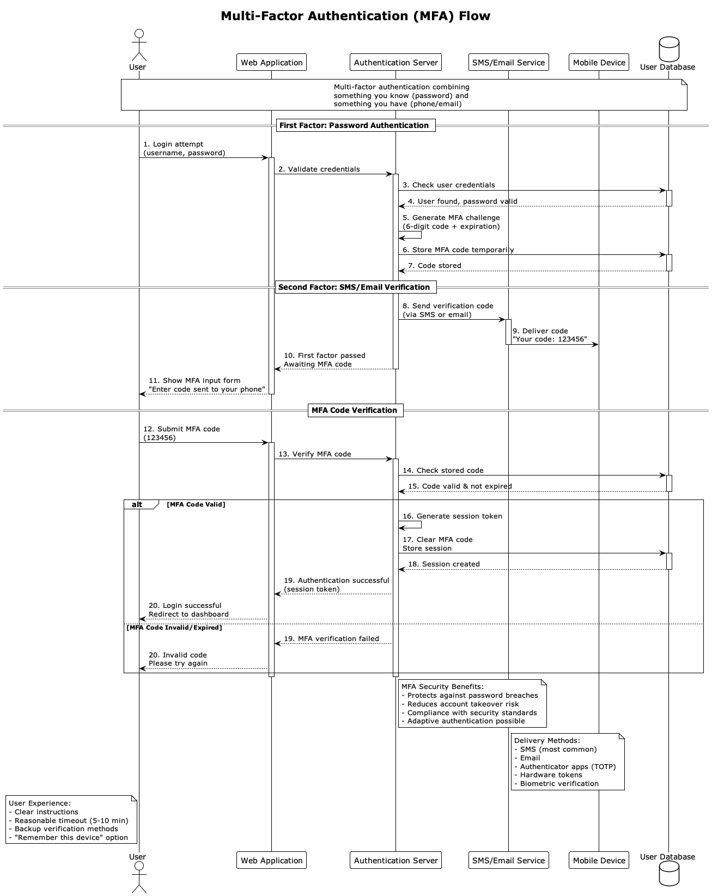

**Description:** Multi-factor authentication system with support for TOTP, SMS, push notifications, and biometrics to increase access security.

**Scores:**
- **Solution Quality:** 9/10
- **Implementation Difficulty:** 7/10
- **Performance Level:** Medium

**When to Use:**
- Systems with highly sensitive data
- Financial or healthcare applications
- Environments requiring regulatory compliance
- Administrative and privileged accounts

**Important Points:**
- Offer multiple second factor options
- Implement backup codes for recovery
- Configure risk-based policies
- Maintain user-friendly UX
- Monitor bypass attempts

---

## 8. Network Segmentation

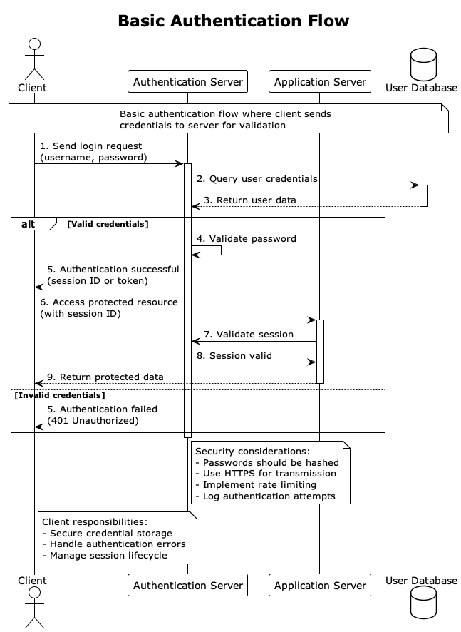

**Description:** Network segmentation architecture with VLANs, subnets, firewalls, and traffic control for resource isolation and protection.

**Scores:**
- **Solution Quality:** 9/10
- **Implementation Difficulty:** 8/10
- **Performance Level:** High

**When to Use:**
- Enterprise environments with multiple systems
- Organizations with different data classifications
- Systems requiring compliance isolation
- Architectures needing breach containment

**Important Points:**
- Define clear security zones
- Configure firewalls between segments
- Implement micro-segmentation when possible
- Monitor inter-segment traffic
- Maintain updated topology documentation

---

## 9. OAuth2 Flow

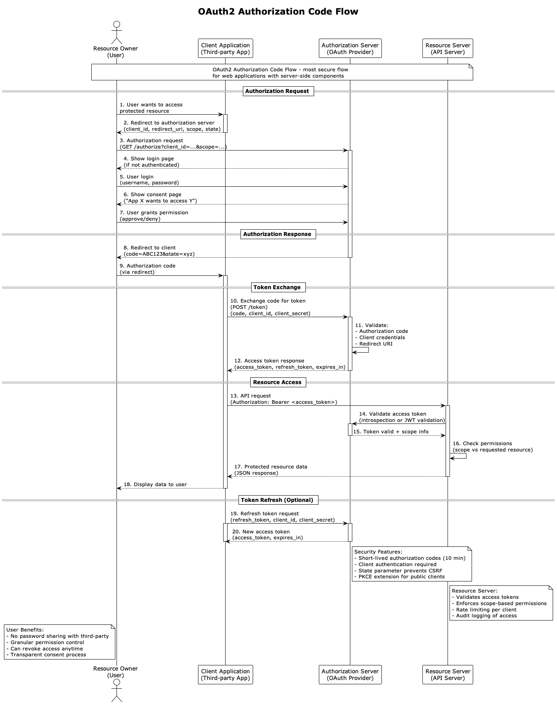

**Description:** Complete OAuth2 flow implementation with different grant types, scope validation, and secure third-party integration.

**Scores:**
- **Solution Quality:** 8/10
- **Implementation Difficulty:** 6/10
- **Performance Level:** High

**When to Use:**
- APIs requiring third-party authorization
- Applications integrating with external services
- Systems requiring access delegation
- Platforms offering public APIs

**Important Points:**
- Choose appropriate grant type for each case
- Validate redirect URIs rigorously
- Implement PKCE for public clients
- Configure granular scopes
- Monitor token usage per application

---

## 10. PCI DSS Compliance

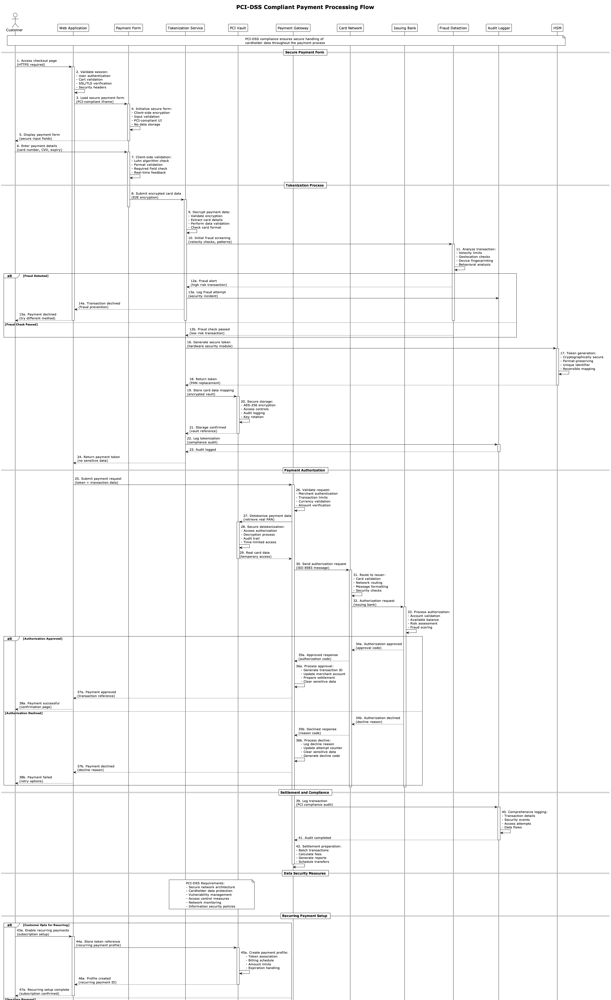

**Description:** PCI DSS compliant architecture for secure credit card data processing, including tokenization and isolation.

**Scores:**
- **Solution Quality:** 9/10
- **Implementation Difficulty:** 9/10
- **Performance Level:** Medium

**When to Use:**
- Systems processing card payments
- E-commerce storing card data
- Financial applications
- Any system handling CHD (Cardholder Data)

**Important Points:**
- Implement sensitive data tokenization
- Configure segmented network for CHD
- Maintain detailed audit logs
- Perform regular penetration testing
- Configure file integrity monitoring

---

## 11. Role-Based Access Control

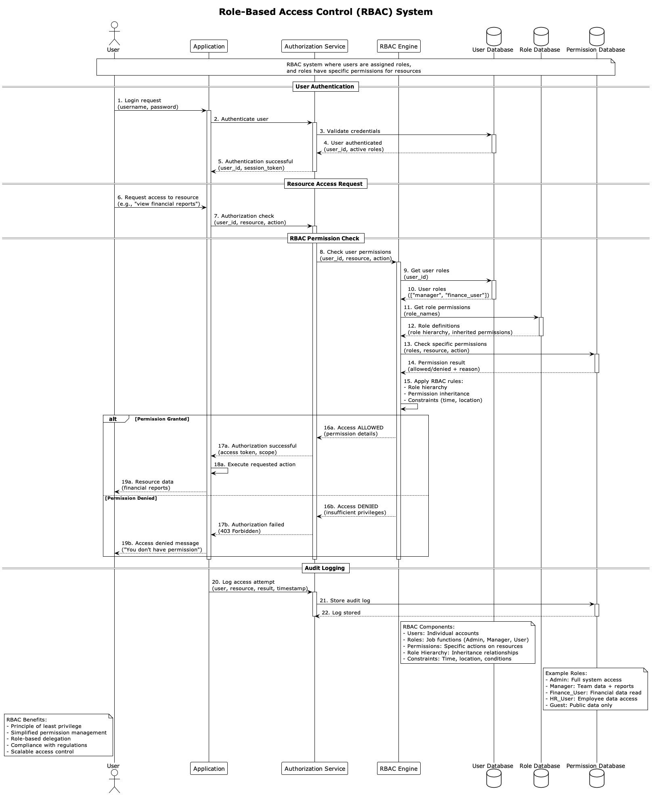

**Description:** RBAC (Role-Based Access Control) system with role hierarchy, granular permissions, and centralized access management.

**Scores:**
- **Solution Quality:** 8/10
- **Implementation Difficulty:** 6/10
- **Performance Level:** High

**When to Use:**
- Enterprise applications with multiple users
- Systems with different access levels
- Organizations with hierarchical structure
- Environments requiring function segregation

**Important Points:**
- Define roles based on business functions
- Implement principle of least privilege
- Configure permission inheritance
- Maintain access change auditing
- Perform periodic permission reviews

---

## 12. SAML Authentication

**Description:** SAML authentication implementation for enterprise SSO with Identity Provider, Service Provider, and secure assertion exchange.

**Scores:**
- **Solution Quality:** 8/10
- **Implementation Difficulty:** 7/10
- **Performance Level:** Medium

**When to Use:**
- Enterprise environments with SSO
- Integration with legacy systems
- Organizations with Active Directory/ADFS
- Applications requiring identity federation

**Important Points:**
- Configure certificates adequately
- Validate assertions rigorously
- Implement single logout (SLO)
- Configure attribute mapping
- Maintain metadata synchronization

---

## 13. Secrets Management

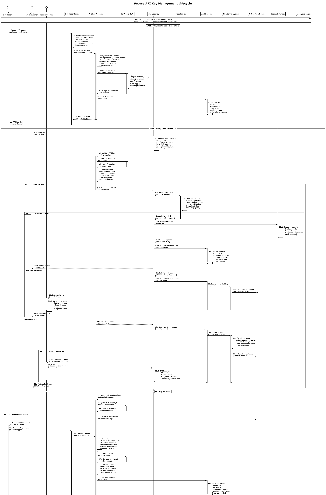

**Description:** Centralized secrets management system (passwords, API keys, certificates) with automatic rotation and controlled access.

**Scores:**
- **Solution Quality:** 9/10
- **Implementation Difficulty:** 7/10
- **Performance Level:** High

**When to Use:**
- Applications with multiple secrets
- CI/CD environments needing credentials
- Systems requiring password rotation
- Organizations with strict security policies

**Important Points:**
- Never store secrets in code
- Implement automatic rotation
- Configure role-based access
- Maintain secrets access auditing
- Use encryption in transit and at rest

---

## 14. Security Monitoring

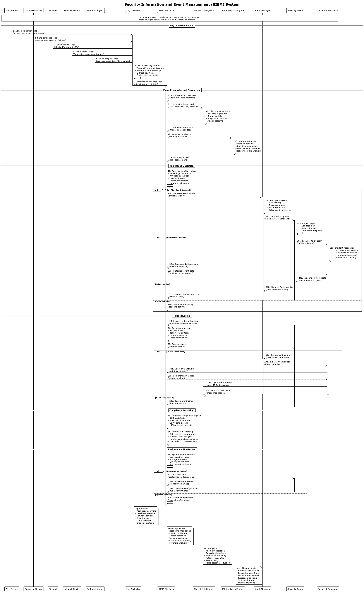

**Description:** Security monitoring system with SIEM, anomaly detection, real-time alerts, and automated incident response.

**Scores:**
- **Solution Quality:** 9/10
- **Implementation Difficulty:** 8/10
- **Performance Level:** High

**When to Use:**
- Organizations requiring SOC (Security Operations Center)
- Business-critical systems
- Environments with compliance requirements
- Applications with high threat exposure

**Important Points:**
- Configure event correlation
- Implement machine learning for detection
- Define incident response playbooks
- Maintain real-time dashboards
- Configure severity-based alerts

---

## 15. SSL/TLS Termination

**Description:** SSL/TLS termination configuration in load balancers with certificates, secure cipher suites and HTTPS redirection.

**Scores:**
- **Solution Quality:** 8/10
- **Implementation Difficulty:** 5/10
- **Performance Level:** High

**When to Use:**
- Web applications requiring HTTPS
- APIs transmitting sensitive data
- Systems needing optimized performance
- Environments with multiple backends

**Important Points:**
- Use TLS 1.2+ exclusively
- Configure secure cipher suites
- Implement HSTS (HTTP Strict Transport Security)
- Configure OCSP stapling
- Monitor SSL handshake performance

---

## 16. Threat Detection

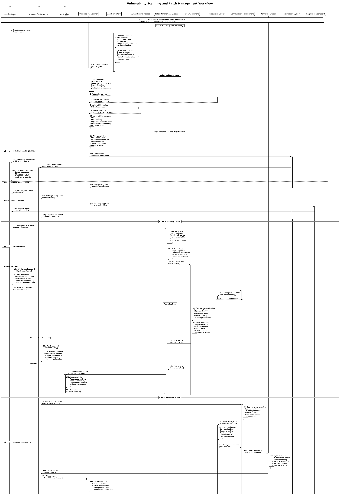

**Description:** Threat detection system with behavioral analysis, machine learning and threat intelligence feeds integration.

**Scores:**
- **Solution Quality:** 9/10
- **Implementation Difficulty:** 9/10
- **Performance Level:** High

**When to Use:**
- Organizations with high threat exposure
- Systems processing critical data
- Environments requiring proactive detection
- Applications with attack history

**Important Points:**
- Configure normal behavior baseline
- Implement machine learning for anomalies
- Integrate with threat intelligence
- Define appropriate alert thresholds
- Maintain low false positive rate

---

## 17. VPN Gateway

**Description:** VPN gateway for secure remote access with strong authentication, encrypted tunnels and granular access control.

**Scores:**
- **Solution Quality:** 8/10
- **Implementation Difficulty:** 6/10
- **Performance Level:** Medium

**When to Use:**
- Remote work requiring access to internal resources
- Secure connection between sites/branches
- Access to legacy systems not publicly exposed
- Environments requiring network isolation

**Important Points:**
- Use secure VPN protocols (IKEv2, OpenVPN)
- Configure multi-factor authentication
- Implement split tunneling when appropriate
- Monitor active connections
- Configure location-based access policies

---

## 18. WAF Protection

**Description:** Web Application Firewall with OWASP Top 10 protection, custom rules and machine learning for attack detection.

**Scores:**
- **Solution Quality:** 9/10
- **Implementation Difficulty:** 6/10
- **Performance Level:** High

**When to Use:**
- Publicly exposed web applications
- APIs requiring attack protection
- Systems with sensitive data
- Environments needing compliance

**Important Points:**
- Configure rules for OWASP Top 10
- Implement rate limiting per IP/user
- Use machine learning for advanced detection
- Configure whitelist for trusted IPs
- Maintain detailed logs for analysis

---

## 19. Zero Trust Architecture

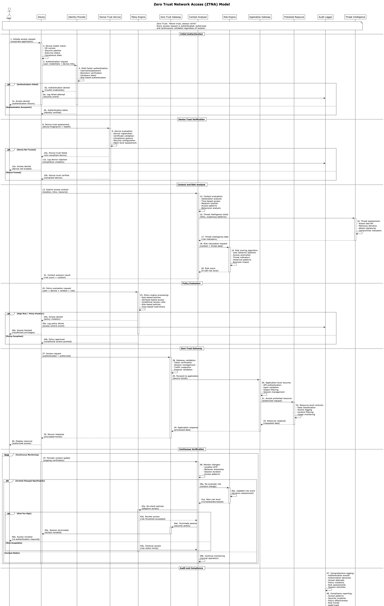

**Description:** Zero Trust architecture that trusts no user or device by default, continuously verifying identity and context.

**Scores:**
- **Solution Quality:** 10/10
- **Implementation Difficulty:** 9/10
- **Performance Level:** High

**When to Use:**
- Organizations with high data sensitivity
- Hybrid environments (cloud + on-premise)
- Systems with extensive remote work
- Architectures requiring maximum security

**Important Points:**
- Implement "never trust, always verify"
- Configure network micro-segmentation
- Use continuous authentication
- Monitor all access in real-time
- Apply principle of least privilege rigorously

---

## 20. Compliance Audit Trail

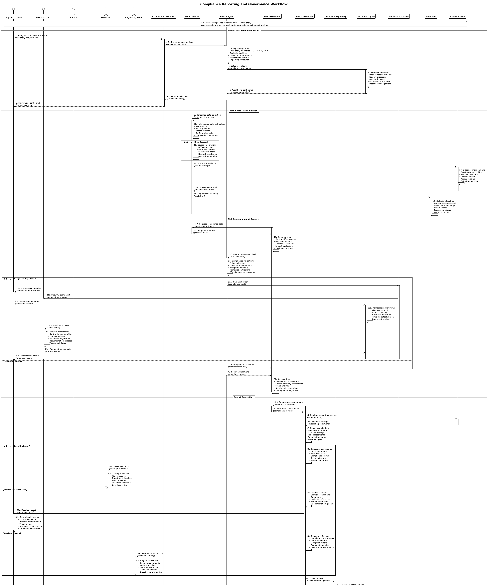

**Description:** Complete audit system that maintains trail of all actions, changes and access for regulatory compliance and investigations.

**Scores:**
- **Solution Quality:** 9/10
- **Implementation Difficulty:** 7/10
- **Performance Level:** Medium

**When to Use:**
- Organizations subject to regulations (SOX, GDPR, HIPAA)
- Financial or healthcare systems
- Environments requiring external auditing
- Applications with highly regulated data

**Important Points:**
- Record all user actions
- Maintain immutable logs
- Configure retention based on regulations
- Implement efficient search and reporting
- Ensure log integrity and non-repudiation

---

## Selection Guide by Security Scenario

### API Protection
- **API Gateway Security** - Access control and rate limiting
- **JWT Token Flow** - Stateless authentication
- **OAuth2 Flow** - Third-party authorization
- **WAF Protection** - Web attack protection

### Regulatory Compliance
- **PCI DSS Compliance** - Payment processing
- **Data Encryption** - Sensitive data protection
- **Compliance Audit Trail** - Audit trail
- **Secrets Management** - Secure credential management

### Authentication and Authorization
- **Multi-Factor Authentication** - Additional security
- **SAML Authentication** - Enterprise SSO
- **Identity Provider Integration** - Centralized identities
- **Role-Based Access Control** - Granular control

### Monitoring and Detection
- **Security Monitoring** - SIEM and SOC
- **Threat Detection** - Proactive detection
- **DDoS Protection** - Attack protection
- **Zero Trust Architecture** - Maximum security

### Secure Infrastructure
- **Network Segmentation** - Resource isolation
- **VPN Gateway** - Secure remote access
- **SSL/TLS Termination** - Encryption in transit
- **Certificate Management** - Certificate management

## Compliance Matrix

### GDPR (General Data Protection Regulation)
- **Data Encryption** - Personal data protection
- **Compliance Audit Trail** - Processing trail
- **Role-Based Access Control** - Access control
- **Secrets Management** - Credential protection

### SOX (Sarbanes-Oxley Act)
- **Compliance Audit Trail** - Financial auditing
- **Role-Based Access Control** - Function segregation
- **Multi-Factor Authentication** - Secure access
- **Security Monitoring** - Continuous monitoring

### HIPAA (Health Insurance Portability and Accountability Act)
- **Data Encryption** - Medical data protection
- **Network Segmentation** - System isolation
- **Compliance Audit Trail** - Access trail
- **Multi-Factor Authentication** - Strong authentication

### PCI DSS (Payment Card Industry Data Security Standard)
- **PCI DSS Compliance** - Specific architecture
- **Data Encryption** - CHD protection
- **Network Segmentation** - Environment isolation
- **WAF Protection** - Web application protection

## Security Levels

### Basic (Startups/SMB)
- **SSL/TLS Termination** - Mandatory HTTPS
- **API Gateway Security** - Basic control
- **JWT Token Flow** - Simple authentication
- **WAF Protection** - Basic web protection

### Intermediate (Medium Companies)
- **Multi-Factor Authentication** - Additional security
- **Role-Based Access Control** - Granular control
- **Secrets Management** - Credential management
- **Security Monitoring** - Basic monitoring

### Advanced (Enterprise)
- **Zero Trust Architecture** - Maximum security
- **Threat Detection** - Advanced detection
- **Network Segmentation** - Micro-segmentation
- **Compliance Audit Trail** - Complete auditing

### Critical (Financial/Healthcare)
- **PCI DSS Compliance** - Specific compliance
- **Data Encryption** - End-to-end encryption
- **Certificate Management** - Complete PKI
- **DDoS Protection** - Maximum protection

---

*Original files available at: `diagrams/security-compliance/`*
*Generated diagrams available at: `docs/generated-diagrams/security-compliance/`*