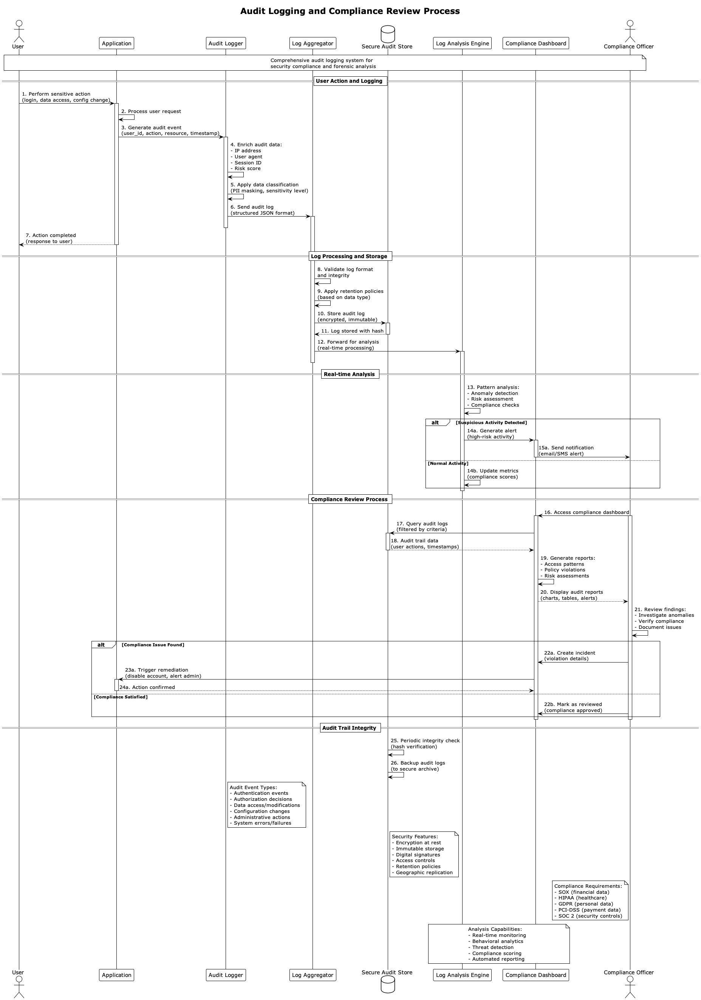

# Security and Compliance - Patterns and Solutions

This section documents 20 diagrams focused on security patterns and compliance for distributed systems.

## Diagram Index

1. [API Gateway Security](#1-api-gateway-security)
2. [Data Encryption](#2-data-encryption)
3. [DDoS Protection](#3-ddos-protection)
4. [Identity Management](#4-identity-management)
5. [Multi-Factor Authentication](#5-multi-factor-authentication)
6. [Network Security](#6-network-security)
7. [OAuth Implementation](#7-oauth-implementation)
8. [Rate Limiting](#8-rate-limiting)
9. [Security Monitoring](#9-security-monitoring)
10. [SSL TLS Implementation](#10-ssl-tls-implementation)
11. [Token Based Authentication](#11-token-based-authentication)
12. [VPN Gateway](#12-vpn-gateway)
13. [WAF Implementation](#13-waf-implementation)
14. [Zero Trust Architecture](#14-zero-trust-architecture)
15. [Compliance Audit Trail](#15-compliance-audit-trail)
16. [Data Loss Prevention](#16-data-loss-prevention)
17. [Incident Response](#17-incident-response)
18. [Penetration Testing](#18-penetration-testing)
19. [Security Automation](#19-security-automation)
20. [Vulnerability Management](#20-vulnerability-management)

---

## 1. API Gateway Security

**Description:** Comprehensive API security implementation using an API gateway with authentication, authorization, rate limiting, and threat protection mechanisms.

**Scores:**
- **Solution Quality:** 9/10
- **Implementation Difficulty:** 7/10
- **Performance Level:** High

**When to Use:**
- Microservices architectures
- Public API endpoints
- Systems requiring centralized security
- Applications with multiple client types

**Important Points:**
- Implement proper authentication mechanisms
- Configure rate limiting per client
- Enable request/response validation
- Monitor API usage patterns
- Implement proper error handling

---

## 2. Data Encryption

**Description:** End-to-end data encryption strategy covering data at rest, in transit, and in processing with proper key management.

**Scores:**
- **Solution Quality:** 10/10
- **Implementation Difficulty:** 8/10
- **Performance Level:** Medium

**When to Use:**
- Sensitive data handling
- Compliance requirements (GDPR, HIPAA)
- Financial applications
- Healthcare systems

**Important Points:**
- Use strong encryption algorithms (AES-256)
- Implement proper key rotation
- Secure key storage and management
- Consider performance impact
- Maintain encryption at all layers

---

## 3. DDoS Protection

**Description:** Multi-layer DDoS protection system with traffic filtering, rate limiting, and automated mitigation strategies.

**Scores:**
- **Solution Quality:** 9/10
- **Implementation Difficulty:** 6/10
- **Performance Level:** High

**When to Use:**
- Public-facing applications
- High-traffic systems
- Critical business applications
- E-commerce platforms

**Important Points:**
- Implement multiple protection layers
- Configure automatic scaling
- Monitor traffic patterns
- Set up alerting systems
- Plan incident response procedures

---

## 4. Identity Management

**Description:** Centralized identity and access management system with user provisioning, authentication, and authorization controls.

**Scores:**
- **Solution Quality:** 9/10
- **Implementation Difficulty:** 8/10
- **Performance Level:** High

**When to Use:**
- Enterprise applications
- Multi-tenant systems
- Applications with complex user hierarchies
- Systems requiring audit trails

**Important Points:**
- Implement single sign-on (SSO)
- Configure role-based access control
- Enable user lifecycle management
- Maintain audit logs
- Integrate with existing directories

---

## 5. Multi-Factor Authentication

**Description:** Multi-factor authentication implementation with various authentication methods including SMS, email, authenticator apps, and biometrics.

**Scores:**
- **Solution Quality:** 9/10
- **Implementation Difficulty:** 6/10
- **Performance Level:** Medium

**When to Use:**
- High-security applications
- Financial services
- Administrative access
- Compliance requirements

**Important Points:**
- Support multiple authentication factors
- Implement backup authentication methods
- Consider user experience
- Enable adaptive authentication
- Monitor authentication patterns

---

## 6. Network Security

**Description:** Comprehensive network security architecture with firewalls, network segmentation, intrusion detection, and monitoring.

**Scores:**
- **Solution Quality:** 9/10
- **Implementation Difficulty:** 8/10
- **Performance Level:** High

**When to Use:**
- Enterprise networks
- Cloud infrastructures
- Multi-tier applications
- Sensitive data environments

**Important Points:**
- Implement network segmentation
- Configure proper firewall rules
- Enable intrusion detection systems
- Monitor network traffic
- Maintain security policies

---

## 7. OAuth Implementation

**Description:** OAuth 2.0 authorization framework implementation with proper token management and secure authorization flows.

**Scores:**
- **Solution Quality:** 8/10
- **Implementation Difficulty:** 7/10
- **Performance Level:** High

**When to Use:**
- Third-party integrations
- API access control
- Mobile applications
- Single sign-on implementations

**Important Points:**
- Use appropriate OAuth flows
- Implement secure token storage
- Configure proper scopes
- Enable token refresh mechanisms
- Monitor authorization patterns

---

## 8. Rate Limiting

**Description:** Advanced rate limiting system with multiple algorithms, client-based limits, and dynamic threshold adjustment.

**Scores:**
- **Solution Quality:** 8/10
- **Implementation Difficulty:** 5/10
- **Performance Level:** High

**When to Use:**
- Public APIs
- Resource protection
- Abuse prevention
- Cost control

**Important Points:**
- Choose appropriate limiting algorithms
- Configure per-client limits
- Implement graceful degradation
- Provide clear error messages
- Monitor usage patterns

---

## 9. Security Monitoring

**Description:** Comprehensive security monitoring and incident detection system with real-time alerting and automated response capabilities.

**Scores:**
- **Solution Quality:** 9/10
- **Implementation Difficulty:** 8/10
- **Performance Level:** High

**When to Use:**
- Production environments
- Compliance requirements
- High-security applications
- Large-scale systems

**Important Points:**
- Implement comprehensive logging
- Configure real-time alerting
- Enable automated responses
- Maintain security dashboards
- Regular security assessments

---

## 10. SSL TLS Implementation

**Description:** Proper SSL/TLS implementation with certificate management, perfect forward secrecy, and security best practices.

**Scores:**
- **Solution Quality:** 9/10
- **Implementation Difficulty:** 6/10
- **Performance Level:** High

**When to Use:**
- All web applications
- API endpoints
- Data transmission security
- Compliance requirements

**Important Points:**
- Use latest TLS versions
- Implement proper certificate management
- Configure strong cipher suites
- Enable HSTS headers
- Monitor certificate expiration

---

## 11. Token Based Authentication

**Description:** JWT-based authentication system with secure token generation, validation, and refresh mechanisms.

**Scores:**
- **Solution Quality:** 8/10
- **Implementation Difficulty:** 6/10
- **Performance Level:** High

**When to Use:**
- Stateless applications
- Microservices architectures
- Mobile applications
- API authentication

**Important Points:**
- Use strong signing algorithms
- Implement proper token expiration
- Secure token storage
- Enable token refresh
- Validate token integrity

---

## 12. VPN Gateway

**Description:** Secure VPN gateway implementation for remote access with multi-protocol support and advanced security features.

**Scores:**
- **Solution Quality:** 8/10
- **Implementation Difficulty:** 7/10
- **Performance Level:** Medium

**When to Use:**
- Remote workforce
- Site-to-site connections
- Secure network access
- Compliance requirements

**Important Points:**
- Configure strong encryption
- Implement user authentication
- Monitor VPN connections
- Maintain connection logs
- Regular security updates

---

## 13. WAF Implementation

**Description:** Web Application Firewall implementation with OWASP protection, custom rules, and automated threat detection.

**Scores:**
- **Solution Quality:** 9/10
- **Implementation Difficulty:** 6/10
- **Performance Level:** High

**When to Use:**
- Web applications
- API protection
- Compliance requirements
- Public-facing services

**Important Points:**
- Configure OWASP rule sets
- Implement custom security rules
- Enable real-time monitoring
- Regular rule updates
- False positive management

---

## 14. Zero Trust Architecture

**Description:** Zero trust security model with continuous verification, least privilege access, and comprehensive monitoring.

**Scores:**
- **Solution Quality:** 10/10
- **Implementation Difficulty:** 9/10
- **Performance Level:** High

**When to Use:**
- Modern security architectures
- Cloud-native applications
- High-security environments
- Distributed systems

**Important Points:**
- Verify every access request
- Implement least privilege principle
- Continuous monitoring and validation
- Micro-segmentation
- Identity-centric security

---

## 15. Compliance Audit Trail

**Description:** Comprehensive audit trail system for compliance requirements with immutable logging and reporting capabilities.

**Scores:**
- **Solution Quality:** 9/10
- **Implementation Difficulty:** 7/10
- **Performance Level:** Medium

**When to Use:**
- Regulated industries
- Compliance requirements
- Financial applications
- Healthcare systems

**Important Points:**
- Implement immutable logging
- Comprehensive event tracking
- Automated compliance reporting
- Data retention policies
- Regular audit procedures

---

## 16. Data Loss Prevention

**Description:** Data loss prevention system with content inspection, policy enforcement, and automated response mechanisms.

**Scores:**
- **Solution Quality:** 8/10
- **Implementation Difficulty:** 8/10
- **Performance Level:** Medium

**When to Use:**
- Sensitive data handling
- Compliance requirements
- Intellectual property protection
- Financial services

**Important Points:**
- Define data classification policies
- Implement content inspection
- Configure automated responses
- Monitor data movement
- Regular policy updates

---

## 17. Incident Response

**Description:** Automated incident response system with threat detection, analysis, containment, and recovery procedures.

**Scores:**
- **Solution Quality:** 9/10
- **Implementation Difficulty:** 8/10
- **Performance Level:** High

**When to Use:**
- Production environments
- Security-critical systems
- Compliance requirements
- Large-scale operations

**Important Points:**
- Automated threat detection
- Rapid response procedures
- Incident containment strategies
- Recovery and remediation
- Post-incident analysis

---

## 18. Penetration Testing

**Description:** Systematic penetration testing framework with automated scanning, manual testing, and vulnerability assessment.

**Scores:**
- **Solution Quality:** 8/10
- **Implementation Difficulty:** 7/10
- **Performance Level:** Medium

**When to Use:**
- Security assessments
- Compliance requirements
- Pre-deployment testing
- Regular security audits

**Important Points:**
- Regular testing schedules
- Comprehensive test coverage
- Vulnerability prioritization
- Remediation tracking
- Third-party assessments

---

## 19. Security Automation

**Description:** Automated security operations with orchestrated responses, threat intelligence integration, and continuous monitoring.

**Scores:**
- **Solution Quality:** 9/10
- **Implementation Difficulty:** 9/10
- **Performance Level:** Very High

**When to Use:**
- Large-scale environments
- 24/7 operations
- Resource optimization
- Consistent security responses

**Important Points:**
- Orchestrated security workflows
- Threat intelligence integration
- Automated response actions
- Continuous improvement
- Human oversight mechanisms

---

## 20. Vulnerability Management

**Description:** Comprehensive vulnerability management program with scanning, assessment, prioritization, and remediation tracking.

**Scores:**
- **Solution Quality:** 8/10
- **Implementation Difficulty:** 7/10
- **Performance Level:** High

**When to Use:**
- All production systems
- Compliance requirements
- Risk management
- Security maintenance

**Important Points:**
- Regular vulnerability scanning
- Risk-based prioritization
- Remediation tracking
- Patch management
- Continuous monitoring

---

## Selection Guide by Security Domain

### Authentication & Authorization
- **Identity Management** - Centralized user management
- **Multi-Factor Authentication** - Enhanced security
- **OAuth Implementation** - Third-party access
- **Token Based Authentication** - Stateless authentication

### Network Security
- **Network Security** - Comprehensive network protection
- **VPN Gateway** - Secure remote access
- **DDoS Protection** - Traffic-based attacks
- **Zero Trust Architecture** - Modern security model

### Application Security
- **API Gateway Security** - API protection
- **WAF Implementation** - Web application protection
- **Rate Limiting** - Abuse prevention
- **Data Encryption** - Data protection

### Monitoring & Compliance
- **Security Monitoring** - Real-time threat detection
- **Compliance Audit Trail** - Regulatory compliance
- **Incident Response** - Automated response
- **Vulnerability Management** - Risk management

## Implementation Complexity

### Low Complexity (1-5/10)
- **Rate Limiting** - Basic traffic control
- **SSL TLS Implementation** - Standard encryption
- **DDoS Protection** - Cloud-based solutions
- **Token Based Authentication** - JWT implementation

### Medium Complexity (6-7/10)
- **API Gateway Security** - Centralized security
- **Multi-Factor Authentication** - Multiple factors
- **OAuth Implementation** - Authorization flows
- **WAF Implementation** - Application firewall

### High Complexity (8-10/10)
- **Zero Trust Architecture** - Comprehensive model
- **Security Automation** - Orchestrated responses
- **Identity Management** - Enterprise-scale IAM
- **Network Security** - Multi-layer protection

## Security Levels

### Maximum Security
- **Zero Trust Architecture** - Comprehensive security model
- **Data Encryption** - End-to-end protection
- **Multi-Factor Authentication** - Strong authentication
- **Security Automation** - Automated threat response

### High Security
- **API Gateway Security** - Centralized protection
- **Network Security** - Multi-layer defense
- **Incident Response** - Rapid threat response
- **Vulnerability Management** - Proactive risk management

### Standard Security
- **SSL TLS Implementation** - Basic encryption
- **Rate Limiting** - Traffic control
- **WAF Implementation** - Web protection
- **Security Monitoring** - Threat detection

## Compliance Frameworks

### GDPR Compliance
- **Data Encryption** - Data protection
- **Compliance Audit Trail** - Activity logging
- **Data Loss Prevention** - Data protection
- **Identity Management** - Access control

### HIPAA Compliance
- **Data Encryption** - PHI protection
- **Network Security** - Secure communications
- **Compliance Audit Trail** - Access logging
- **Multi-Factor Authentication** - Strong authentication

### PCI DSS Compliance
- **Network Security** - Secure networks
- **Data Encryption** - Cardholder data protection
- **Vulnerability Management** - Regular testing
- **Security Monitoring** - Continuous monitoring

### SOX Compliance
- **Compliance Audit Trail** - Financial controls
- **Identity Management** - Access controls
- **Security Monitoring** - Activity monitoring
- **Data Loss Prevention** - Information protection

---

*Original files available at: `diagrams/security-compliance/`*
*Generated diagrams available at: `docs/generated-diagrams/security-compliance/`*