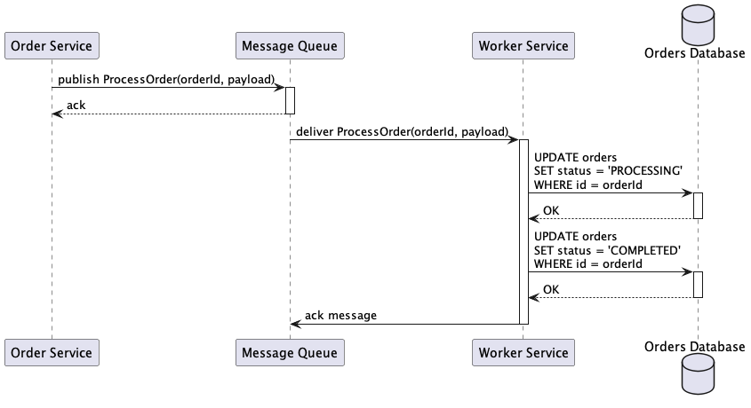
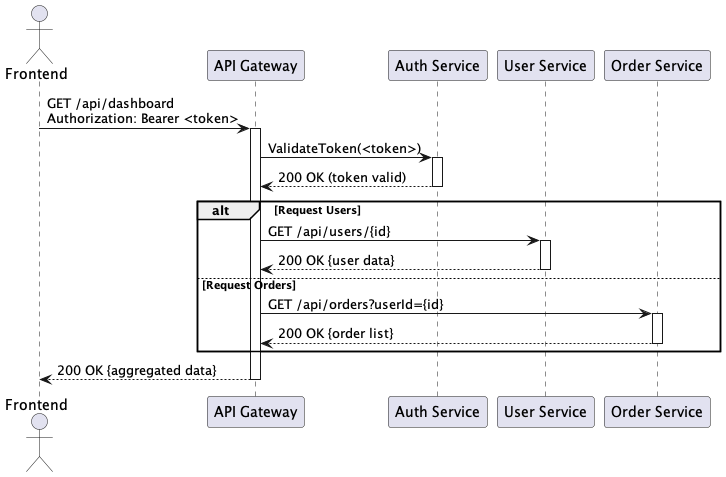
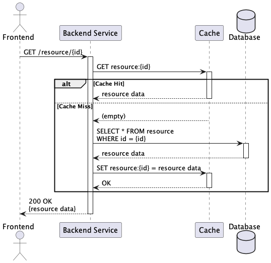
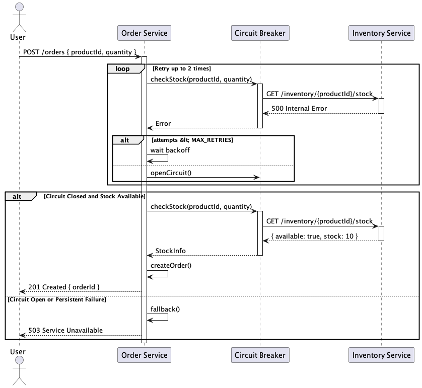
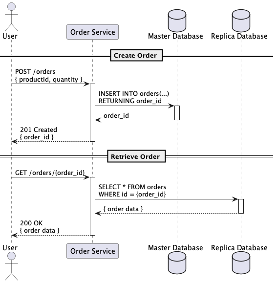
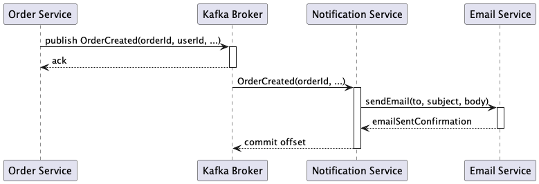
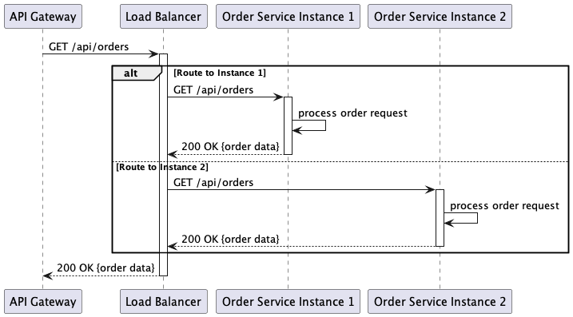
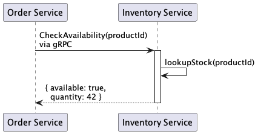
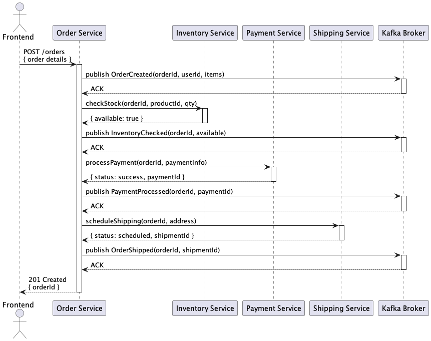

# Sequence Diagrams - Solutions and Flows

This section documents 20 sequence diagrams that illustrate communication flows, component interactions, and solutions for specific scenarios in distributed systems.

## Diagram Index

1. [API Rate Limiting](#1-api-rate-limiting)
2. [Async Message Processing](#2-async-message-processing)
3. [Authentication Flow](#3-authentication-flow)
4. [Cache Invalidation](#4-cache-invalidation)
5. [Circuit Breaker Flow](#5-circuit-breaker-flow)
6. [Database Transaction](#6-database-transaction)
7. [Event Sourcing](#7-event-sourcing)
8. [File Upload Process](#8-file-upload-process)
9. [Health Check System](#9-health-check-system)
10. [Load Balancer Routing](#10-load-balancer-routing)
11. [Microservice Communication](#11-microservice-communication)
12. [Order Processing](#12-order-processing)
13. [Payment Gateway](#13-payment-gateway)
14. [Retry Mechanism](#14-retry-mechanism)
15. [Saga Pattern](#15-saga-pattern)
16. [Service Discovery](#16-service-discovery)
17. [Session Management](#17-session-management)
18. [Timeout Handling](#18-timeout-handling)
19. [User Registration](#19-user-registration)
20. [Webhook Processing](#20-webhook-processing)

---

## 1. API Rate Limiting

**Description:** Request rate control flow (rate limiting) in APIs, showing how limits are verified, applied, and how clients are notified when they exceed limits.

**Scores:**
- **Solution Quality:** 8/10
- **Implementation Difficulty:** 6/10
- **Performance Level:** High

**When to Use:**
- Public APIs that need usage control
- Systems requiring abuse protection
- Applications with limited resources
- Environments needing to guarantee SLA for all users

**Important Points:**
- Implement different strategies (token bucket, sliding window)
- Configure limits based on user/API key
- Return informative headers (X-RateLimit-*)
- Consider distributed rate limiting for multiple instances
- Implement whitelist for privileged users

---

## 2. Async Message Processing

**Description:** Asynchronous message processing flow using queues, showing production, consumption, acknowledgment, and failure handling.

**Scores:**
- **Solution Quality:** 9/10
- **Implementation Difficulty:** 7/10
- **Performance Level:** Very High

**When to Use:**
- Processing that doesn't require immediate response
- Systems with variable load spikes
- Architectures needing decoupling
- Applications processing large data volumes

**Important Points:**
- Configure dead letter queues for failed messages
- Implement idempotency in processing
- Use appropriate acknowledgment (auto/manual)
- Monitor queue sizes
- Configure adequate retry policies

---

## 3. Authentication Flow

**Description:** Complete authentication flow showing login, credential validation, token generation and resource authorization.

**Scores:**
- **Solution Quality:** 8/10
- **Implementation Difficulty:** 6/10
- **Performance Level:** High

**When to Use:**
- Applications requiring access control
- Systems with multiple users
- APIs needing authentication
- Environments requiring access auditing

**Important Points:**
- Use HTTPS for all communications
- Implement rate limiting for login attempts
- Configure appropriate token expiration
- Maintain logs of authentication attempts
- Implement account lockout after consecutive failures

---

## 4. Cache Invalidation

**Description:** Cache invalidation flow showing how data is updated, cache is invalidated and new information is loaded.

**Scores:**
- **Solution Quality:** 8/10
- **Implementation Difficulty:** 7/10
- **Performance Level:** High

**When to Use:**
- Systems with frequently changing data
- Applications requiring data consistency
- Architectures with multiple cache layers
- Distributed environments with shared cache

**Important Points:**
- Implement invalidation strategies (TTL, manual, event-based)
- Configure invalidation propagation in distributed systems
- Use cache tags for granular invalidation
- Monitor hit ratio after invalidations
- Consider cache warming after invalidation

---

## 5. Circuit Breaker Flow

**Description:** Circuit Breaker pattern flow showing states (closed, open, half-open), failure detection and gradual recovery.

**Scores:**
- **Solution Quality:** 9/10
- **Implementation Difficulty:** 7/10
- **Performance Level:** High

**When to Use:**
- Microservices with external dependencies
- Systems making frequent network calls
- Applications needing to prevent failure cascades
- Architectures requiring high resilience

**Important Points:**
- Configure appropriate failure thresholds
- Implement adequate timeout for calls
- Define fallback strategies
- Monitor circuit breaker states
- Configure recovery period (half-open)

---

## 6. Database Transaction

**Description:** Database transaction flow showing begin, operations, commit/rollback and error handling.

**Scores:**
- **Solution Quality:** 8/10
- **Implementation Difficulty:** 6/10
- **Performance Level:** Medium

**When to Use:**
- Operations requiring ACID consistency
- Multiple operations that must be atomic
- Financial or critical systems
- Applications manipulating related data

**Important Points:**
- Keep transactions as short as possible
- Implement timeout for long transactions
- Use appropriate isolation levels
- Configure retry for deadlocks
- Monitor blocked transactions

---

## 7. Event Sourcing

**Description:** Event Sourcing flow showing event capture, storage, state projection and event replay.

**Scores:**
- **Solution Quality:** 9/10
- **Implementation Difficulty:** 8/10
- **Performance Level:** High

**When to Use:**
- Systems requiring complete audit trails
- Applications needing data replay capability
- CQRS (Command Query Responsibility Segregation) architectures
- Complex domains with evolving business rules

**Important Points:**
- Design immutable and versioned events
- Implement snapshots for performance
- Configure appropriate event retention
- Maintain backward compatibility
- Monitor event store size

---

## 8. File Upload Process

**Description:** File upload flow showing validation, storage, asynchronous processing and completion notification.

**Scores:**
- **Solution Quality:** 8/10
- **Implementation Difficulty:** 6/10
- **Performance Level:** High

**When to Use:**
- Applications allowing file uploads
- Systems processing media or documents
- Content sharing platforms
- Applications requiring file processing

**Important Points:**
- Validate file type and size
- Use direct upload to cloud storage when possible
- Implement progress tracking for large uploads
- Configure antivirus scanning
- Maintain file metadata

---

## 9. Health Check System

**Description:** Health check flow showing component verification, status aggregation and response to load balancers.

**Scores:**
- **Solution Quality:** 8/10
- **Implementation Difficulty:** 5/10
- **Performance Level:** High

**When to Use:**
- Distributed systems with multiple components
- Applications using load balancers
- Architectures requiring automatic monitoring
- Environments with auto-scaling

**Important Points:**
- Implement lightweight and fast health checks
- Verify critical dependencies
- Configure different health levels (liveness, readiness)
- Keep low timeout for health checks
- Avoid failure cascade in health checks

---

## 10. Load Balancer Routing

**Description:** Load balancer routing flow showing backend selection, health checking and automatic failover.

**Scores:**
- **Solution Quality:** 8/10
- **Implementation Difficulty:** 6/10
- **Performance Level:** High

**When to Use:**
- Applications with multiple instances
- Systems requiring high availability
- Architectures needing load distribution
- Environments with horizontal scaling

**Important Points:**
- Configure appropriate balancing algorithm
- Implement robust health checks
- Configure sticky sessions when necessary
- Monitor load distribution
- Maintain fast failover

---

## 11. Microservice Communication

**Description:** Communication flow between microservices showing synchronous, asynchronous calls and failure handling.

**Scores:**
- **Solution Quality:** 9/10
- **Implementation Difficulty:** 7/10
- **Performance Level:** High

**When to Use:**
- Microservice architectures
- Complex distributed systems
- Applications requiring independent scalability
- Environments with multiple development teams

**Important Points:**
- Implement circuit breakers between services
- Use service discovery for location
- Configure appropriate timeout for calls
- Maintain versioned API contracts
- Monitor latency between services

---

## 12. Order Processing

**Description:** Order processing flow showing validation, inventory reservation, payment and fulfillment.

**Scores:**
- **Solution Quality:** 9/10
- **Implementation Difficulty:** 8/10
- **Performance Level:** High

**When to Use:**
- E-commerce systems
- Marketplace applications
- Online sales platforms
- Systems requiring complex workflow

**Important Points:**
- Implement distributed transactions (Saga pattern)
- Configure compensation for failures
- Maintain consistent state between services
- Implement idempotency in operations
- Monitor each step of the process

---

## 13. Payment Gateway

**Description:** Payment processing flow showing tokenization, authorization, capture and notification webhooks.

**Scores:**
- **Solution Quality:** 9/10
- **Implementation Difficulty:** 8/10
- **Performance Level:** High

**When to Use:**
- Applications processing payments
- E-commerce systems
- Subscription platforms
- Marketplaces with multiple vendors

**Important Points:**
- Use tokenization for sensitive data
- Implement retry with exponential backoff
- Configure webhooks for notifications
- Maintain detailed logs for auditing
- Implement transaction reconciliation

---

## 14. Retry Mechanism

**Description:** Retry mechanism flow showing attempts, exponential backoff, jitter and eventual failure.

**Scores:**
- **Solution Quality:** 8/10
- **Implementation Difficulty:** 6/10
- **Performance Level:** High

**When to Use:**
- Systems with unstable external dependencies
- Applications making network calls
- Third-party API integrations
- Environments with frequent transient failures

**Important Points:**
- Configure exponential backoff with jitter
- Define maximum number of attempts
- Implement circuit breaker as fallback
- Use retry only for transient errors
- Monitor success rate after retries

---

## 15. Saga Pattern

**Description:** Saga pattern flow for distributed transactions showing step execution and compensation in case of failure.

**Scores:**
- **Solution Quality:** 9/10
- **Implementation Difficulty:** 9/10
- **Performance Level:** High

**When to Use:**
- Transactions involving multiple microservices
- Systems that cannot use distributed ACID transactions
- Long-running business processes
- Architectures requiring eventual consistency

**Important Points:**
- Design compensation operations for each step
- Implement idempotency in all operations
- Maintain persistent saga state
- Configure timeout for long steps
- Monitor saga execution and failures

---

## 16. Service Discovery

**Description:** Service discovery flow showing registration, lookup, health checking and endpoint updates.

**Scores:**
- **Solution Quality:** 8/10
- **Implementation Difficulty:** 7/10
- **Performance Level:** High

**When to Use:**
- Dynamic microservice architectures
- Systems with auto-scaling
- Containerized environments (Docker, Kubernetes)
- Cloud-native applications

**Important Points:**
- Configure health checks for registered services
- Implement local cache to reduce latency
- Use client-side load balancing when possible
- Configure appropriate TTL for records
- Monitor service registry availability

---

## 17. Session Management

**Description:** Session management flow showing creation, validation, renewal and session expiration.

**Scores:**
- **Solution Quality:** 8/10
- **Implementation Difficulty:** 6/10
- **Performance Level:** High

**When to Use:**
- Web applications with user state
- Systems requiring persistent authentication
- Applications with multiple pages/screens
- Environments needing continuous access control

**Important Points:**
- Configure appropriate session expiration
- Use distributed storage for sessions
- Implement automatic renewal of active sessions
- Configure logout across multiple tabs/devices
- Keep minimal data in session

---

## 18. Timeout Handling

**Description:** Timeout handling flow showing configuration, detection, cancellation and recovery strategies.

**Scores:**
- **Solution Quality:** 8/10
- **Implementation Difficulty:** 6/10
- **Performance Level:** High

**When to Use:**
- Systems with network calls
- Applications integrating with external services
- Architectures requiring strict SLA
- Environments with limited resources

**Important Points:**
- Configure timeouts based on SLA
- Implement operation cancellation
- Use different timeouts for read/write
- Configure retry with increasing timeout
- Monitor operations that frequently timeout

---

## 19. User Registration

**Description:** User registration flow showing validation, account creation, email verification and activation.

**Scores:**
- **Solution Quality:** 8/10
- **Implementation Difficulty:** 6/10
- **Performance Level:** High

**When to Use:**
- Applications requiring user registration
- Systems with access control
- Platforms needing identity verification
- Applications with user onboarding

**Important Points:**
- Validate input data rigorously
- Implement email/phone verification
- Use secure hash for passwords
- Configure rate limiting for registrations
- Keep activation process simple

---

## 20. Webhook Processing

**Description:** Webhook processing flow showing receipt, validation, asynchronous processing and confirmation.

**Scores:**
- **Solution Quality:** 8/10
- **Implementation Difficulty:** 7/10
- **Performance Level:** High

**When to Use:**
- Integrations with external systems
- Applications receiving real-time notifications
- Payment and e-commerce systems
- Platforms needing data synchronization

**Important Points:**
- Validate webhook signature/authenticity
- Process webhooks asynchronously
- Implement idempotency for reprocessing
- Configure retry for failed webhooks
- Maintain detailed logs for debugging

---

## Selection Guide by Communication Pattern

### Synchronous Communication
- **Authentication Flow** - Real-time authentication
- **API Rate Limiting** - Immediate access control
- **Load Balancer Routing** - Load distribution
- **Database Transaction** - ACID operations

### Asynchronous Communication
- **Async Message Processing** - Background processing
- **Event Sourcing** - Event capture
- **Webhook Processing** - External notifications
- **File Upload Process** - Upload with processing

### Resilience Patterns
- **Circuit Breaker Flow** - Failure cascade prevention
- **Retry Mechanism** - Transient failure recovery
- **Timeout Handling** - Time limit control
- **Health Check System** - Health monitoring

### Distributed Transactions
- **Saga Pattern** - Long-running transactions
- **Order Processing** - Complex workflow
- **Payment Gateway** - Financial processing
- **Microservice Communication** - Service coordination

### State Management
- **Session Management** - User state
- **Cache Invalidation** - Cache consistency
- **Service Discovery** - Service location
- **User Registration** - User lifecycle

## Implementation Complexity

### Low Complexity (1-4/10)
- **Health Check System** - Simple checks
- **API Rate Limiting** - Basic control
- **Authentication Flow** - Standard flow
- **Session Management** - Basic management

### Medium Complexity (5-7/10)
- **Load Balancer Routing** - Intelligent distribution
- **Retry Mechanism** - Retry strategies
- **Cache Invalidation** - Cache synchronization
- **File Upload Process** - Upload with validation

### High Complexity (8-10/10)
- **Saga Pattern** - Distributed transactions
- **Event Sourcing** - Event-based architecture
- **Order Processing** - Complex workflow
- **Payment Gateway** - Financial processing

## Performance and Latency

### Very Low Latency (<10ms)
- **Cache Invalidation** - In-memory operations
- **Health Check System** - Fast checks
- **Session Management** - Local validation
- **Load Balancer Routing** - Direct routing

### Low Latency (<100ms)
- **API Rate Limiting** - Fast verification
- **Authentication Flow** - Efficient validation
- **Service Discovery** - Cached lookup
- **Microservice Communication** - Optimized calls

### Medium Latency (<500ms)
- **Database Transaction** - Database operations
- **User Registration** - Validation and creation
- **Timeout Handling** - Operations with limits
- **Webhook Processing** - Simple processing

### High Latency (>500ms)
- **File Upload Process** - Upload and processing
- **Payment Gateway** - External validation
- **Order Processing** - Complete workflow
- **Saga Pattern** - Multiple steps

---

*Original files available at: `diagrams/sequence-diagram-solutions/`*
*Generated diagrams available at: `docs/generated-diagrams/sequence-diagram-solutions/`*