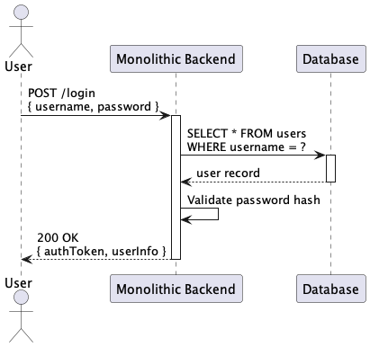
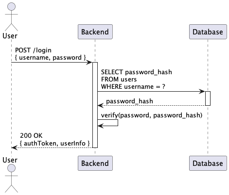
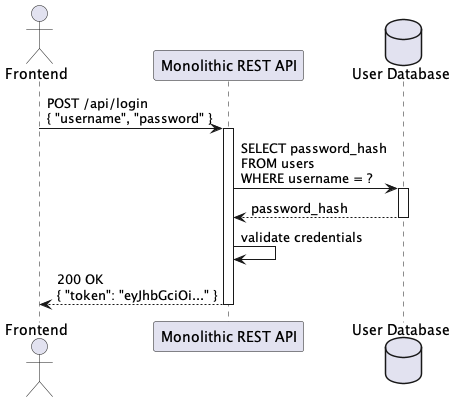
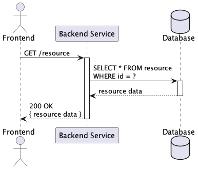
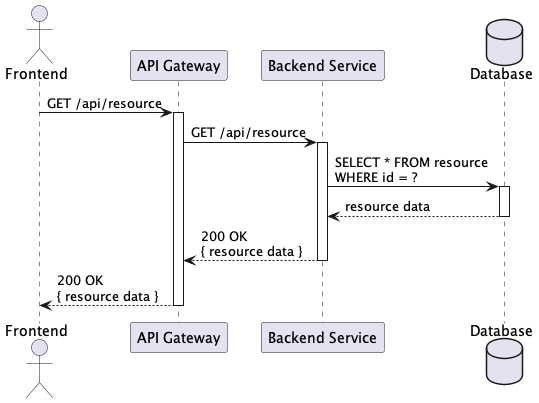

# Sequence Diagram Solutions - Patterns and Flows

This section documents 20 sequence diagrams showcasing common architectural patterns and interaction flows in distributed systems.

## Diagram Index

1. [Simple Login Sequence](#1-simple-login-sequence)
2. [User Registration Flow](#2-user-registration-flow)
3. [Password Reset Flow](#3-password-reset-flow)
4. [E-commerce Checkout](#4-e-commerce-checkout)
5. [API Rate Limiting](#5-api-rate-limiting)
6. [Database Transaction](#6-database-transaction)
7. [Microservice Communication](#7-microservice-communication)
8. [Event Driven Processing](#8-event-driven-processing)
9. [Circuit Breaker Pattern](#9-circuit-breaker-pattern)
10. [Saga Pattern Transaction](#10-saga-pattern-transaction)
11. [CQRS Implementation](#11-cqrs-implementation)
12. [OAuth Authorization](#12-oauth-authorization)
13. [Webhook Processing](#13-webhook-processing)
14. [File Upload Process](#14-file-upload-process)
15. [Cache Aside Pattern](#15-cache-aside-pattern)
16. [Message Queue Processing](#16-message-queue-processing)
17. [Distributed Lock](#17-distributed-lock)
18. [Health Check System](#18-health-check-system)
19. [Audit Log System](#19-audit-log-system)
20. [Full Modern Architecture](#20-full-modern-architecture)

---

## 1. Simple Login Sequence

**Description:** Basic user authentication flow with username/password validation, session creation, and response handling.

**Scores:**
- **Solution Quality:** 7/10
- **Implementation Difficulty:** 3/10
- **Performance Level:** High

**When to Use:**
- Simple web applications
- MVP implementations
- Internal tools with basic security
- Learning and prototyping

**Important Points:**
- Implement secure password hashing
- Use HTTPS for credential transmission
- Consider session timeout policies
- Add rate limiting for login attempts
- Implement proper error handling

---

## 2. User Registration Flow

**Description:** Complete user registration process with validation, email verification, and account activation.

**Scores:**
- **Solution Quality:** 8/10
- **Implementation Difficulty:** 5/10
- **Performance Level:** Medium

**When to Use:**
- User-facing applications
- Systems requiring email verification
- Applications with user onboarding
- SaaS platforms

**Important Points:**
- Validate input data thoroughly
- Implement email verification
- Use secure password requirements
- Handle duplicate registrations
- Provide clear user feedback

---

## 3. Password Reset Flow

**Description:** Secure password reset mechanism with token generation, email delivery, and password update validation.

**Scores:**
- **Solution Quality:** 8/10
- **Implementation Difficulty:** 6/10
- **Performance Level:** Medium

**When to Use:**
- Applications with user authentication
- Systems requiring self-service password reset
- Security-conscious applications
- Enterprise user management

**Important Points:**
- Generate secure reset tokens
- Implement token expiration
- Use secure email delivery
- Validate new password strength
- Log security events

---

## 4. E-commerce Checkout

**Description:** Complete e-commerce checkout process with inventory validation, payment processing, and order confirmation.

**Scores:**
- **Solution Quality:** 9/10
- **Implementation Difficulty:** 8/10
- **Performance Level:** Medium

**When to Use:**
- E-commerce platforms
- Online marketplaces
- Subscription services
- Digital product sales

**Important Points:**
- Validate inventory availability
- Handle payment failures gracefully
- Implement transaction rollback
- Ensure data consistency
- Provide order confirmation

---

## 5. API Rate Limiting

**Description:** API rate limiting implementation with request counting, threshold checking, and response handling.

**Scores:**
- **Solution Quality:** 8/10
- **Implementation Difficulty:** 5/10
- **Performance Level:** High

**When to Use:**
- Public APIs
- Resource protection
- Abuse prevention
- Cost control mechanisms

**Important Points:**
- Choose appropriate limiting algorithms
- Implement per-client tracking
- Provide clear error responses
- Consider burst allowances
- Monitor usage patterns

---

## 6. Database Transaction

**Description:** Database transaction management with ACID properties, rollback handling, and connection management.

**Scores:**
- **Solution Quality:** 9/10
- **Implementation Difficulty:** 6/10
- **Performance Level:** High

**When to Use:**
- Data consistency requirements
- Multi-step operations
- Financial transactions
- Critical business operations

**Important Points:**
- Ensure ACID compliance
- Implement proper rollback
- Manage connection pooling
- Handle deadlock scenarios
- Monitor transaction performance

---

## 7. Microservice Communication

**Description:** Inter-service communication pattern with service discovery, load balancing, and failure handling.

**Scores:**
- **Solution Quality:** 9/10
- **Implementation Difficulty:** 7/10
- **Performance Level:** High

**When to Use:**
- Microservices architectures
- Distributed systems
- Service-oriented architectures
- Cloud-native applications

**Important Points:**
- Implement service discovery
- Handle network failures
- Use circuit breakers
- Implement retry mechanisms
- Monitor service health

---

## 8. Event Driven Processing

**Description:** Event-driven architecture with event publishing, subscription handling, and asynchronous processing.

**Scores:**
- **Solution Quality:** 9/10
- **Implementation Difficulty:** 7/10
- **Performance Level:** Very High

**When to Use:**
- Loosely coupled systems
- Real-time processing
- Scalable architectures
- Event sourcing patterns

**Important Points:**
- Ensure event ordering
- Handle duplicate events
- Implement dead letter queues
- Monitor event processing
- Design for eventual consistency

---

## 9. Circuit Breaker Pattern

**Description:** Circuit breaker implementation for fault tolerance with failure detection, state management, and recovery.

**Scores:**
- **Solution Quality:** 9/10
- **Implementation Difficulty:** 6/10
- **Performance Level:** High

**When to Use:**
- Distributed systems
- External service dependencies
- Fault-tolerant architectures
- High-availability systems

**Important Points:**
- Configure appropriate thresholds
- Implement fallback mechanisms
- Monitor circuit state
- Handle partial failures
- Test recovery scenarios

---

## 10. Saga Pattern Transaction

**Description:** Saga pattern for distributed transactions with compensation actions and failure recovery.

**Scores:**
- **Solution Quality:** 10/10
- **Implementation Difficulty:** 9/10
- **Performance Level:** Medium

**When to Use:**
- Distributed transactions
- Microservices coordination
- Long-running processes
- Complex business workflows

**Important Points:**
- Design compensation actions
- Handle partial failures
- Implement saga orchestration
- Monitor transaction state
- Ensure data consistency

---

## 11. CQRS Implementation

**Description:** Command Query Responsibility Segregation with separate read/write models and event sourcing.

**Scores:**
- **Solution Quality:** 9/10
- **Implementation Difficulty:** 8/10
- **Performance Level:** Very High

**When to Use:**
- Complex domain models
- High-performance requirements
- Event sourcing architectures
- Scalable read/write operations

**Important Points:**
- Separate command and query models
- Implement event sourcing
- Handle eventual consistency
- Optimize read projections
- Monitor synchronization lag

---

## 12. OAuth Authorization

**Description:** OAuth 2.0 authorization flow with client registration, user consent, and token exchange.

**Scores:**
- **Solution Quality:** 8/10
- **Implementation Difficulty:** 7/10
- **Performance Level:** High

**When to Use:**
- Third-party integrations
- API access control
- Single sign-on implementations
- Mobile applications

**Important Points:**
- Validate redirect URIs
- Implement PKCE for security
- Handle token refresh
- Configure appropriate scopes
- Monitor authorization patterns

---

## 13. Webhook Processing

**Description:** Webhook processing system with signature verification, payload validation, and retry mechanisms.

**Scores:**
- **Solution Quality:** 8/10
- **Implementation Difficulty:** 6/10
- **Performance Level:** High

**When to Use:**
- Third-party integrations
- Real-time notifications
- Event-driven architectures
- Payment processing

**Important Points:**
- Verify webhook signatures
- Implement idempotency
- Handle retry logic
- Validate payload structure
- Monitor webhook health

---

## 14. File Upload Process

**Description:** Secure file upload process with validation, virus scanning, and storage management.

**Scores:**
- **Solution Quality:** 8/10
- **Implementation Difficulty:** 6/10
- **Performance Level:** Medium

**When to Use:**
- Document management systems
- Media upload platforms
- User-generated content
- File sharing applications

**Important Points:**
- Validate file types and sizes
- Implement virus scanning
- Use secure storage
- Handle upload failures
- Provide progress feedback

---

## 15. Cache Aside Pattern

**Description:** Cache-aside pattern implementation with cache miss handling, data loading, and cache population.

**Scores:**
- **Solution Quality:** 8/10
- **Implementation Difficulty:** 5/10
- **Performance Level:** Very High

**When to Use:**
- Performance optimization
- Database load reduction
- Frequently accessed data
- Read-heavy applications

**Important Points:**
- Handle cache misses gracefully
- Implement cache invalidation
- Monitor cache hit rates
- Consider cache warming
- Handle cache failures

---

## 16. Message Queue Processing

**Description:** Message queue processing with producer/consumer pattern, acknowledgments, and error handling.

**Scores:**
- **Solution Quality:** 9/10
- **Implementation Difficulty:** 6/10
- **Performance Level:** Very High

**When to Use:**
- Asynchronous processing
- Decoupled architectures
- Load leveling
- Background job processing

**Important Points:**
- Implement message acknowledgments
- Handle processing failures
- Configure dead letter queues
- Monitor queue depth
- Ensure message durability

---

## 17. Distributed Lock

**Description:** Distributed locking mechanism for resource coordination with acquisition, renewal, and release.

**Scores:**
- **Solution Quality:** 8/10
- **Implementation Difficulty:** 7/10
- **Performance Level:** Medium

**When to Use:**
- Resource synchronization
- Distributed systems coordination
- Critical section protection
- Leader election scenarios

**Important Points:**
- Implement lock timeouts
- Handle lock renewal
- Prevent deadlocks
- Monitor lock contention
- Ensure lock release

---

## 18. Health Check System

**Description:** Comprehensive health check system with dependency validation, status aggregation, and alerting.

**Scores:**
- **Solution Quality:** 8/10
- **Implementation Difficulty:** 5/10
- **Performance Level:** High

**When to Use:**
- Production monitoring
- Load balancer integration
- Service mesh environments
- Automated deployment systems

**Important Points:**
- Check critical dependencies
- Implement graceful degradation
- Configure appropriate timeouts
- Provide detailed status information
- Monitor health check performance

---

## 19. Audit Log System

**Description:** Comprehensive audit logging system with event capture, enrichment, and secure storage.

**Scores:**
- **Solution Quality:** 9/10
- **Implementation Difficulty:** 6/10
- **Performance Level:** Medium

**When to Use:**
- Compliance requirements
- Security monitoring
- Regulatory audits
- Change tracking

**Important Points:**
- Capture all relevant events
- Ensure log immutability
- Implement secure storage
- Provide search capabilities
- Monitor log integrity

---

## 20. Full Modern Architecture

**Description:** Complete modern architecture sequence with microservices, event sourcing, CQRS, and distributed patterns.

**Scores:**
- **Solution Quality:** 10/10
- **Implementation Difficulty:** 10/10
- **Performance Level:** Very High

**When to Use:**
- Enterprise-scale applications
- High-performance systems
- Complex business domains
- Cloud-native architectures

**Important Points:**
- Implement comprehensive monitoring
- Design for fault tolerance
- Use distributed tracing
- Implement proper security
- Plan for scalability

---

## Selection Guide by Use Case

### Authentication & Authorization
- **Simple Login Sequence** - Basic authentication
- **User Registration Flow** - User onboarding
- **Password Reset Flow** - Self-service password management
- **OAuth Authorization** - Third-party access control

### E-commerce & Transactions
- **E-commerce Checkout** - Online purchase flows
- **Database Transaction** - Data consistency
- **Saga Pattern Transaction** - Distributed transactions
- **Distributed Lock** - Resource coordination

### Performance & Scalability
- **Cache Aside Pattern** - Performance optimization
- **API Rate Limiting** - Resource protection
- **Message Queue Processing** - Asynchronous processing
- **CQRS Implementation** - Read/write optimization

### Reliability & Monitoring
- **Circuit Breaker Pattern** - Fault tolerance
- **Health Check System** - System monitoring
- **Audit Log System** - Compliance and tracking
- **Webhook Processing** - Event handling

### Architecture Patterns
- **Microservice Communication** - Service interaction
- **Event Driven Processing** - Loosely coupled systems
- **File Upload Process** - Content management
- **Full Modern Architecture** - Complete enterprise solution

## Implementation Complexity

### Low Complexity (1-4/10)
- **Simple Login Sequence** - Basic authentication
- **API Rate Limiting** - Traffic control
- **Cache Aside Pattern** - Simple caching
- **Health Check System** - Basic monitoring

### Medium Complexity (5-7/10)
- **User Registration Flow** - User management
- **Password Reset Flow** - Security workflows
- **Database Transaction** - Data consistency
- **Microservice Communication** - Service interaction

### High Complexity (8-10/10)
- **Saga Pattern Transaction** - Distributed coordination
- **CQRS Implementation** - Advanced patterns
- **Full Modern Architecture** - Enterprise architecture
- **Event Driven Processing** - Complex event handling

## Performance Levels

### Very High Performance
- **Event Driven Processing** - Asynchronous processing
- **Message Queue Processing** - Decoupled operations
- **Cache Aside Pattern** - Data caching
- **CQRS Implementation** - Optimized read/write
- **Full Modern Architecture** - Comprehensive optimization

### High Performance
- **Simple Login Sequence** - Fast authentication
- **API Rate Limiting** - Efficient throttling
- **Database Transaction** - Optimized data access
- **Microservice Communication** - Distributed efficiency
- **Circuit Breaker Pattern** - Fault tolerance
- **OAuth Authorization** - Secure access
- **Webhook Processing** - Real-time events
- **Health Check System** - Quick status checks

### Medium Performance
- **User Registration Flow** - User onboarding
- **Password Reset Flow** - Security processes
- **E-commerce Checkout** - Transaction processing
- **File Upload Process** - Content handling
- **Distributed Lock** - Coordination overhead
- **Audit Log System** - Logging operations
- **Saga Pattern Transaction** - Distributed coordination

## Business Domain Applications

### E-commerce
- **E-commerce Checkout** - Purchase processing
- **User Registration Flow** - Customer onboarding
- **API Rate Limiting** - API protection
- **Audit Log System** - Transaction tracking

### Financial Services
- **Database Transaction** - Financial operations
- **Saga Pattern Transaction** - Complex workflows
- **Audit Log System** - Regulatory compliance
- **Distributed Lock** - Resource coordination

### SaaS Platforms
- **OAuth Authorization** - Third-party integration
- **Microservice Communication** - Service architecture
- **Event Driven Processing** - Real-time features
- **Health Check System** - Service monitoring

### Enterprise Systems
- **Full Modern Architecture** - Complete solution
- **CQRS Implementation** - Performance optimization
- **Circuit Breaker Pattern** - Reliability
- **Message Queue Processing** - Scalable processing

---

*Original files available at: `diagrams/sequence-diagram-solutions/`*
*Generated diagrams available at: `docs/generated-diagrams/sequence-diagram-solutions/`*